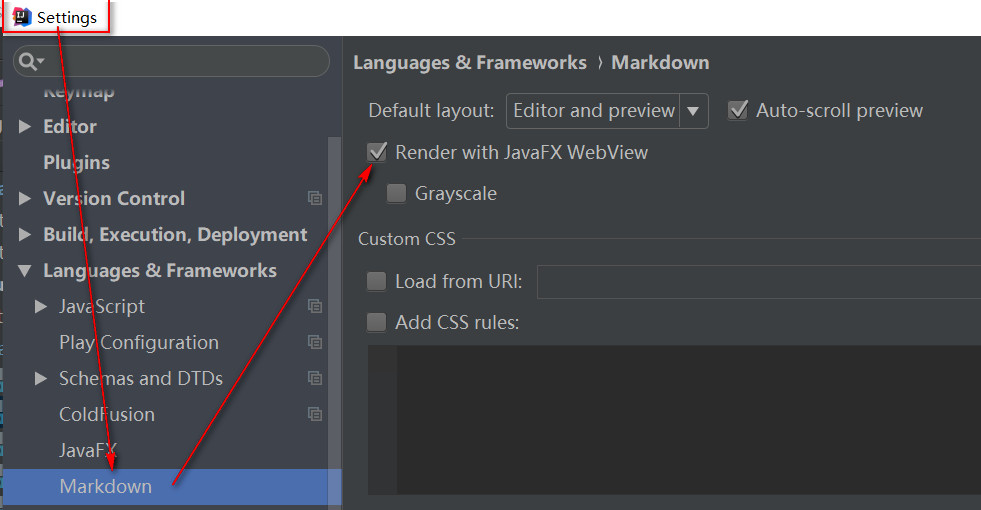

## 是什么
是一种标记语法（用一些关键字标识内容，赋予其含义的语法）   
[点我打开markdown语法学习网站](https://www.mdeditor.com/)

## 如何使用
- idae中新建.md文件直接使用
- 电脑中需安装软件，再新建.md文件使用。如：[typora](https://www.typora.io/)、[vnote](https://tamlok.github.io/vnote/zh_cn/#!downloads.md)、[YuWriter](https://ivarptr.github.io/yu-writer.site/download.html)
- github中新建.md文件直接使用

## 在idea中预览不正确的设置

