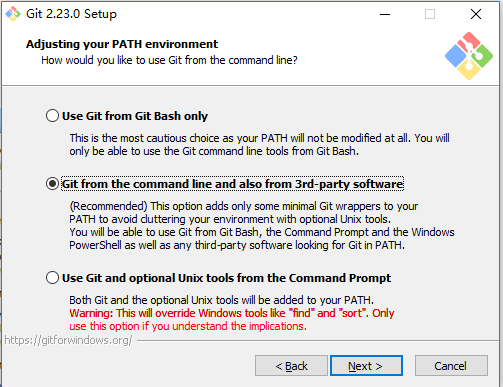
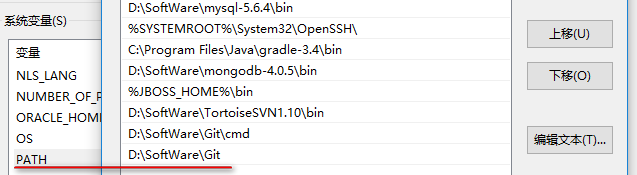
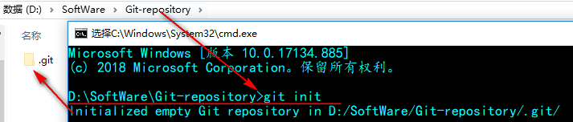

## 下载
[https://git-scm.com/download/win]()

## 安装
  
安装完成后配置环境变量  
  

## 配置
+ git命令列表：git config --list
+ 查看git版本：git --version
+ 设置你的 Git 用户名：git config --global user.name "woody1435"
+ 设置你的 Git 邮箱：git config --global user.email "woody1435@163.com"
+ 确保 Git 输出内容带有颜色标记：git config --global color.ui auto
+ 对比显示原始状态：git config --global merge.conflictstyle diff3
+ 结合自己的代码编辑器：git config --global core.editor " D:\\Software\Notepad++\\notepad++.exe"
### 仓库地址
  
本地仓库随着软件卸载删除后，以后还能找回里面的资源吗?  