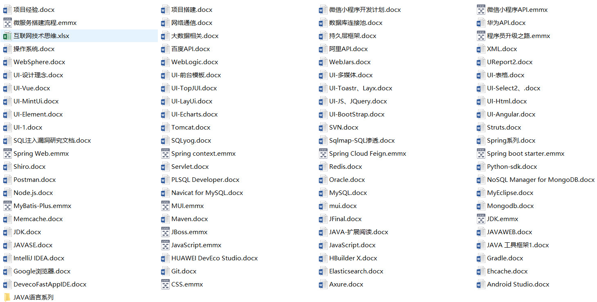

**正在学习中的框架或工具，大家可以从对应项目模块中查找看看是否对自己有用的用法、文档、注释...**
+ JDK源码
+ hutool实用工具框架
+ github最流行的代码管理工具
+ intellij-idea智能代码编辑器
+ markdown编辑器
+ junit测试框架
+ apach_poi excel、word、pdf操作工具

## 为什么我要将源码、文档、截图（笔记类的东西）放在项目中？
**我以前的笔记是这样的：**  
  

**现在笔记是这样的：**  

  
**这样做的主要原因有以下几点：**    
1.实践出真知，笔记做的再好，没有动手实践永远不是自己的  
2.一处编辑，多端分享，方便安全  
3.分享出来和大家一同交流想法，共同成长，构建美好开源社区  

