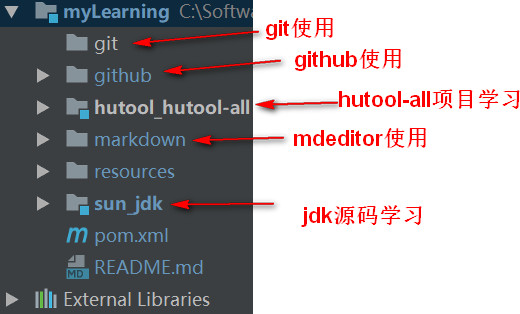

**正在学习中的框架、工具等，大家可以从对应项目模块中查找看看是否对自己有用的用法、文档、注释...**
+ apach_poi：excel、word、pdf操作工具
+ apach_svn：版本控制
+ axure_axure：原型工具
+ glassFish_servlet：servlet-api源码学习
+ hutool：实用工具框架
+ intellij-idea：智能代码编辑器
+ markdown：编辑器
+ junit：测试框架
+ git：版本控制
+ github：最流行的代码管理平台
+ oracle_jdk：JDK源码
+ OSCHINA_gitee：开源中国的代码管理平台-码云

## 为什么我要将源码、文档、截图（笔记类的东西）放在项目中？
**我以前的笔记是这样的：**  
  

**现在笔记是这样的：**  

  
**这样做的主要原因有以下几点：**    
1.实践出真知，笔记做的再好，没有动手实践永远不是自己的  
2.一处编辑，多端分享，方便安全  
3.分享出来和大家一同交流想法，共同成长，构建美好开源社区  
