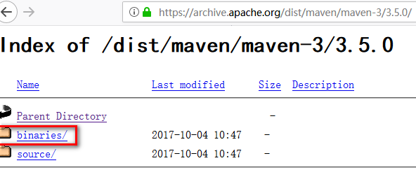

## 下载
[http://maven.apache.org/download.cgi]()

## 安装
1. JDK安装好并配置环境变量，因为maven是java编写的
2. 解压到指定路径（如 D:\SoftWare\apache-maven-3.6.0）
3. 配置环境变量：
新建：MAVEN_HOME  值为：D:\SoftWare\apache-maven-3.6.0
找到Path在环境变量值尾部加入：;%MAVEN_HOME%\bin;  //前面注意分号
4. 测试是否安装成功：
