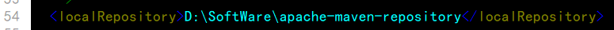
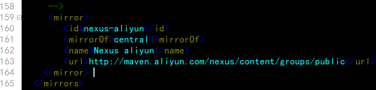
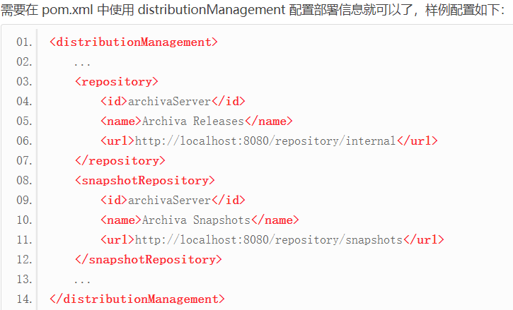
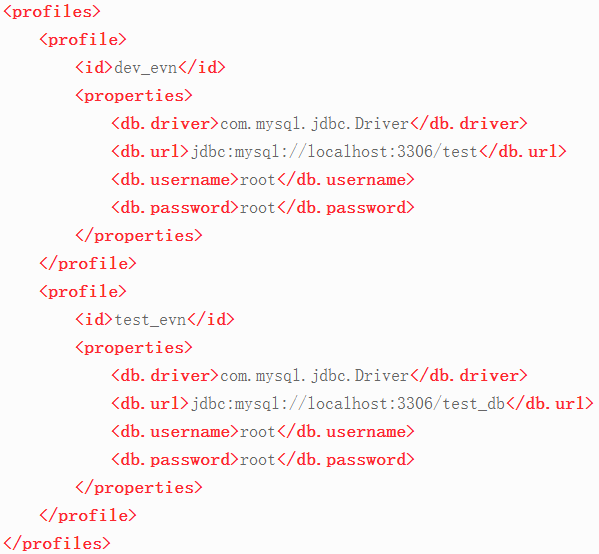
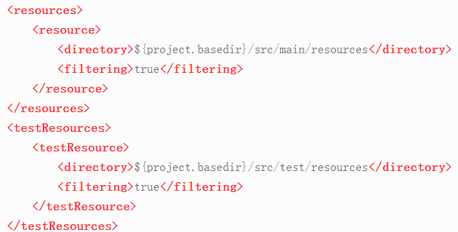
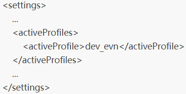
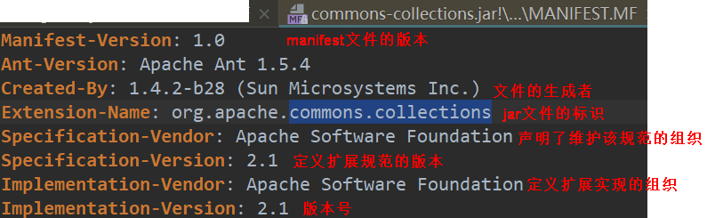

## 镜像仓库
如果仓库 A 能提供仓库 B 存储的所有服务，那么就把 A 叫作 B 的镜像。比如 http://maven.net.cn/content/groups/public 就是中央仓库 http://repo1.maven.org/maven2/ 在中国的镜像。
### 配置镜像仓库为阿里源
修改maven配置文件：apache-maven-3.5.0\conf\setting  
  
找到mirrors节点  
  
```xml
<mirror>
        <id>nexus-aliyun</id>
        <mirrorOf>central</mirrorOf>
        <name>Nexus aliyun</name>
        <url>http://maven.aliyun.com/nexus/content/groups/public</url>
</mirror>
```

## 插件的获取和配置
至于每个阶段由谁来做，Maven 自己不去实现，而是让对应的插件去完成

### 绑定方式
#### 内置绑定
为了让用户方便使用 Maven，少进行配置甚至不用配置，就需要用 Maven 构建项目。Maven 在安装好后，自动为生命周期的主要阶段绑定很多插件的目标。

#### 自定义绑定
比如，有时用户希望在构建工程时能将源代码打成 jar 包，Maven 没有内置绑定到生命周期的阶段上。所以这就需要用户自己配置了。
 
自定义插件尽量使用非快照版本，这样可以避免因为插件版本的不稳定，从而影响构件的不稳定。

### 查看插件绑定的默认生命周期阶段
mvn help:describe -Dplugin=org.apache.maven.plugins:maven-source-plugin:3.0.0 -Ddetail

### 插件参数配置
#### 命令行配置参数
#### pom 配置参数
对于有些参数在项目创建好后，目标每次执行的时候都不需要改变，这时候比较好的方式是把这些值配置到 pom.xml 中，这样就省去每次构建的时候都需要输入的麻烦。
详见依赖配置

### Archetype
生成 Maven 项目骨架（项目的目录结构和 pom.xml）
#### maven-archetype-webapp

### maven-compile-plugin
目标能完成编译任务

### maven-clean-plugin 
作用是删除项目构建时产生的输出目录

### maven-site-plugin 
site 目标，用来生成项目站点；
deploy 目标，用来将生成的站点发布到站点服务器上去

### maven-help-plugin
获取插件的详细信息

### maven-surefire-plugin
测试插件，能很好地兼容 JUnit 系列和 TestNG 测试框架

### maven resource plugin
对资源文件进行处理

### maven-jar-plugin
打包安装与部署

### maven-war-plugin
对 src/main/webapp 资源目录开启过滤功能

### 自定义插件

### 仓库分类
当局域网内部的 Maven 用户需要构件的时候，先是从自己的本地仓库中查找，没有找到，就在私服上面查找（前提是配置了），还没找到，就从外部的远程仓库查找并下载。
#### 本地仓库
##### 配置本地仓库位置
```xml
<settings>
    ...
    <localRepository>
        C:/java/servers/apache-archiva-2.2.1/repositories/internal
    </localRepository>
    ...
</settings>
```
#### 远程仓库
##### 中央仓库
Maven 自带的远程仓库，它包含了绝大部分开源的构件
##### 私服
为了节省带宽，节约下载构件的时间，在局域网内架设一个私有的仓库服务器用来代理所有的外部远程仓库。局域网里面的项目还能部署到私服上供其他项目使用。
##### 公共仓库

### 添加远程仓库
```xml
<repositories>
    <repository>
        <id>jboss</id>
        <name>JBoss Maven Repository</name>
        <url>http://repository.jboss.com/maven2/</url>
        <releases>
            <enabled>true</enabled>
        </releases>
        <snapshots>
            <enabled>false</enabled>
        </snapshots>
        <layout>default</layout>
    </repository>
</repositories>
```
每个仓库的 id 都要是唯一的  
releases 和 snapshots，它们的子元素 enabled 的值配置成 true 或 false 的时候，表示开启或关闭对应版本的构件下载

### 添加本地Jar包
命令行输入：  
mvn install:install-file -Dfile=.\ojdbc14.jar -DgroupId=com.oracle -DartifactId=ojdbc14 -Dversion=10.2.0.4.0 -Dpackaging=jar

命令解释：mvn install:install-file -Dfile=本地jar包路径 -DgroupId=可查看groupID -DartifactId=查看artifactId -Dversion=查看version -Dpackaging=jar

提示build Success即可  

### 将自己的 Maven 项目构建成构件，发布到远程仓库中  
  
repository 表示发布版本的构件仓库，snapshotRepository 表示快照版本的构件仓库。id 和 name 分别是仓库的唯一标记与名称  
在 pom.xml 中完成了上面类似的配置后，使用 Maven 命令 mvn deploy，Maven 就会自动将构建输出的构件部署到对应的仓库中  

### 资源过滤的配置
Maven中配置，其它地方引用  


 
setting文件显示激活开发环境  

 
### MANIFEST.MF

 
