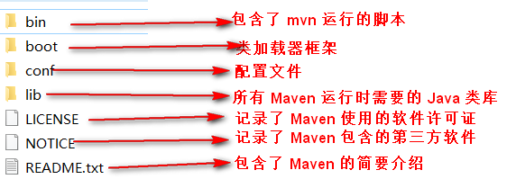
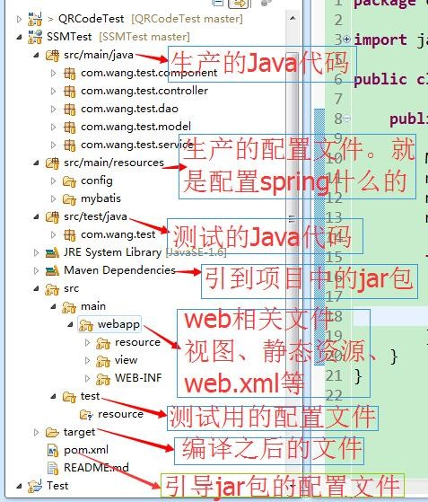
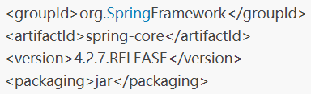
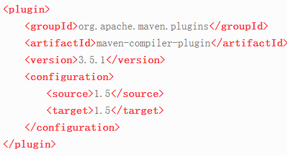
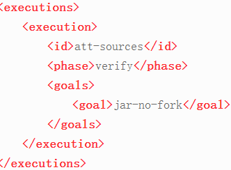
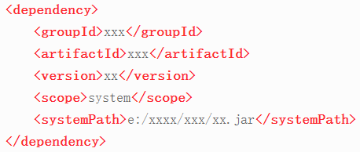
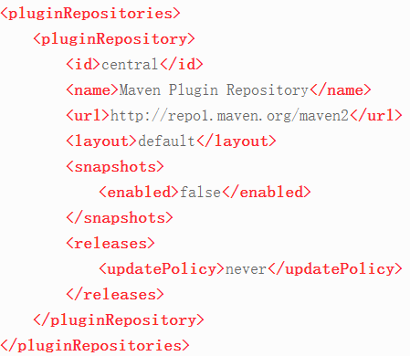
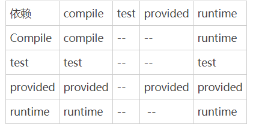
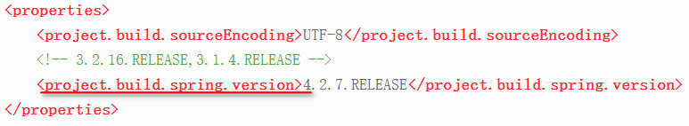

## 目录结构说明

## maven工程各文件夹作用

## 概念
### groupId
组Id   
定义当前 Maven 项目从属的实际项目    

### artifactId
构件 Id  
定义实际项目中的一个 Maven 项目（实际项目中的一个模块）  

### packaging
定义 Maven 项目的打包方式  
项目的打包类型：pom、jar（默认）、war  
父级项目:   
packaging都为pom,pom文件除了GAV(groupId, artifactId, version)是必须要配置的，另一个重要的属性就是packaging打包类型  
子项目:   
GV如果不配置，则会从父级项目的配置继承过来。子模块可通过dependencies标签来添加自己的依赖，此外子类项目的packaging值只能是war或者jar。如果是需要部署的项目，则需要打包成war类型，如果只是内部调用或者是作服务使用，则推荐打包成jar类型。  

### version
定义 Maven 当前所处的版本

### classifier
定义构件输出的附属构件

### packageName
包名

### name
声明了一个对于用户更为友好的项目名称，不是必须的，推荐为每个pom声明name，以方便信息交流

### configuration
  
通过<source＞1.5＜/source＞与＜target＞1.5＜/target＞这两个配置指定编译 Java 1.5 的源代码，生成于 JVM 1.5 兼容的字节码文件，也就是 class 文件。  

### execution
排除传递性依赖  
  

### type
依赖的类型  

### scope
依赖的范围
1. compile
编译依赖范围。如果在配置的时候没有指定，就默认使用这个范围。使用该范围的依赖，对编译、测试、运行三种 classpath 都有效
2. test
测试依赖范围。使用该范围的依赖只对测试 classpath 有效，在编译主代码或运行项目的时候，这种依赖是无效的。
3. provided
已提供依赖范围。使用此范围的依赖，只在编译和测试 classpath 的时候有效，运行项目的时候是无效的。比如 Web 应用中的 servlet-api，编译和测试的时候就需要该依赖，运行的时候，因为容器中自带了 servlet-api，就没必要使用了。如果使用了，反而有可能出现版本不一致的冲突。
4. runtime
运行时依赖范围。使用该范围的依赖，只对测试和运行的 classpath 有效，但在编译主代码时是无效的。比如 JDBC 驱动实现类，就需要在运行测试和运行主代码时候使用，编译的时候，只需 JDBC 接口就行
5. system
系统依赖范围。该范围与 classpath 的关系，同 provided 一样。但是，使用 system 访问时，必须通过 systemPath 元素指定依赖文件的路径。因为该依赖不是通过 Maven 仓库解析的，建议谨慎使用。  
  
6. import
导入依赖范围。该依赖范围不会对三种 classpath 产生实际的影响。它的作用是将其他模块（如模块A）定义好的 dependencyManagement 导入当前（模块B） Maven 项目 pom 的 dependencyManagement 中。

### optional
标记依赖是否可选  

### phase
配置的是哪个绑定的阶段  

### pluginRepository
配置插件的远程仓库  
  

### 传递性依赖
在使用 Maven 之前，如果要基于 Spring 框架开发项目，除了要加入 Spring 框架的 jar 包外，还需要将 Spring 框架所用到的第三方 jar 包加入。否则编译通过，但是运行的时候就会出现 classNotFound 异常。  
现在有三个项目（A、B 和 C 项目），假设 A 依赖 B，B 依赖 C，这样把 A 对 B 的依赖叫第一直接依赖，B 对 C 的依赖叫第二直接依赖，而 A 对 C 的依赖叫传递依赖（通过 B 传递的）。  

坐标第一列表示第一直接依赖的范围，第一行表示第二直接依赖的范围，中间的交叉点为共同影响后的传递依赖的范围。    
  

通过前面的表格，可以得出如下规律。  
+ 当第二直接依赖为 compile 的时候，传递依赖同第一直接依赖一致。
+ 当第二直接依赖为 test 的时候，没有传递依赖。
+ 当第二直接依赖为 provided 的时候，值将第一直接依赖中的 provided 以 provided 的形式传递。
+ 当第二直接依赖为 runtime 的时候，传递依赖的范围基本上同第一直接依赖的范围一样，但 compile 除外，compile 的传递依赖范围为 runtime

### dependencies

### dependencyManagement
+ 如果父pom中使用的是<dependencies>....</dependencies>的方式，则子pom会自动使用pom中的jar包
+ 如果父pom使用dependencyManagement则子pom不会自动使用父pom中的jar包，如果子pom想使用的话，就要给出groupId和artifactId， version(可继承父模块的，也可自行定义版本)  
**总结：哪个模块用到什么引入什么, 保持子模块独立**  

### 依赖的调解
#### 依赖调解原则
#### 可选依赖

### 排除依赖
exclusions→exclusion  

### properties-归类依赖
模块统一版本配置标签  
  

使用  
＄{project.build.spring.version}  

### 快照版本
SNAPSHOT
每一个小版本更新的临时性版本叫快照版本

### 发布版本
向团队外部发布一个比较稳定的版本。就算后期有更多的功能要继续开发，完成后也不会改变当前发布版本的内容，这样的版本叫发布版本。

### 主干
项目开发的主体，也是主线、关键历程。从这里可以获取项目的最新代码和绝大部分的变更历史。

### 分支
从主线某个点分离出去的一段分支。在一个特别时间点的时候，既要保持项目的总体（主线）进度，又要同步修改某些重要漏洞、或实现特殊功能、或实验性开发，就可以创建一个分支独立进行。分支达到预期效果后，需要将分支里面的变更合并到主线中去。

### 标签
用来标记分支和主干进展到某个状态的点，代表项目进展到某个阶段或某个相对比较稳定的状态。实际项目中，这种状态往往就是版本发布的状态。

### GPG（GnuPG）
可以为文件生成签名、管理密匙以及验证签名。

## 属性
### 内置属性
+ ＄{basedir}：项目的根目录  
+ ＄{version}：项目的版本  

### POM 属性
+ ＄{project.build.sourceDirectory}：项目的主源码目录，默认是 src/main/java。
+ ＄{project.build.testSourceDirectory}：项目的测试源码目录，默认是 src/test/java。
+ ＄{project.build.directory}：项目构建输出目录，默认是 target。
+ ＄{project.outputDirectory}：项目主代码编译输出目录，默认是 target/classes。
+ ＄{project.testOutputDirectory}：项目测试代码编译输出目录，默认是 target/testclasses。
+ ＄{project.groupId}：项目的 groupId。
+ ＄{project.artifactId}：项目的 artifactId。
+ ＄{project.version}：项目的版本。
+ ＄{project.build.finalName}：项目输出的文件名称，默认为“＄{project.artifactId}-＄{project.version}”

### 自定义属性
用户可以在 pom 的 properties 中定义自己的 Maven 属性

### Settings 属性
Settings 属性同 POM 属性是一样的，可以用以“settings.”开头的属性引用 settings.xml 文件中 XML 元素的值。如使用“＄{settings.localRepository}”指向用户本地仓库的地址。

### Java 系统属性	
所有的 Java 系统属性都可以通过 Maven 属性引用，比如“＄{user.home}”指向的就是用户目录。用户可以通过使用“mvn help:system”命令查看所有的 Java 系统属性

### 环境变量属性
所有的环境变量都可以用以“evn.”开头的 Maven 属性引用。比如，“＄{evn.JAVA_HOME}”就指向引用了 JAVA_HOME 环境变量的值。可以使用命令“mvn help:system”查看到所有的环境变量。
