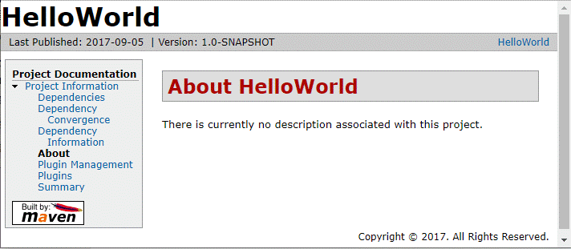
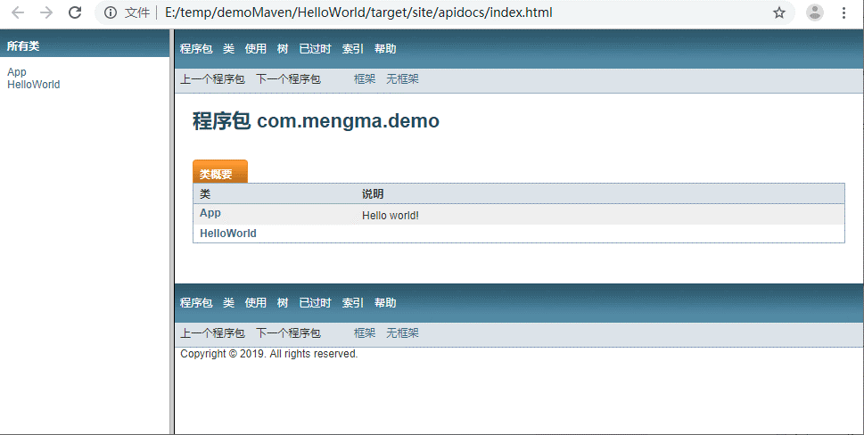

**注意切换到工程目录下操作**
### mvn help:system
查看Java 系统属性，环境变量

### mvn clean
调用 clean 生命周期的 clean 阶段，实际执行的是 clean 生命周期中的 pre-clean 和 clean 阶段

### mvn clean install
该命令调用 clean 生命周期的 clean 阶段和 default 生命周期的 install 阶段。

### mvn compile
编译源代码

### mvn dependency:list
列出所有的依赖列表

### mvn dependency:tree
以树形结构方式，列出依赖和层次关系

### mvn dependency:analyze
分析主代码、测试代码编译的依赖

### mvn test
该命令调用 default 生命周期中的 test 阶段。也就是把 default 生命周期中从开始到 test 的所有阶段都执行完了，而且是按顺序执行。

### mvn install
将当前代码打成 jar 包，安装到 Maven 的本地管理目录下，其他 Maven 工程只要指定坐标就可以使用

### mvn site
生成站点信息，用来描述项目相关的信息(工程\target\site 目录下）

### mvn javadoc:Javadoc
生成 API Doc 文档（工程\target\site\apidocs 目录下）

### mvn package
打包

