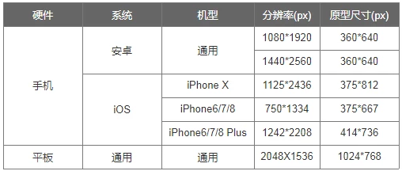
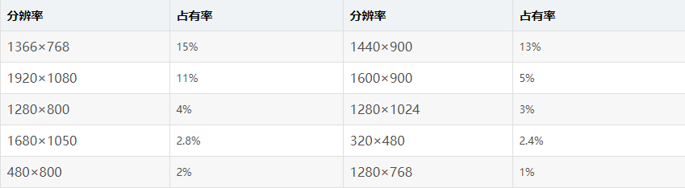

## Axure与mockplus 区别
Axure 高保真。  mockplus 上手简单，中低保真。

## 移动设备分辨率与原型尺寸对照表
怎么才能知道任何一个移动设备的原型页面尺寸应该是多少呢？
实际上Axure RP 9所给出的原型页面尺寸是设备的逻辑分辨率。
如果我们能够获得一个设备的逻辑分辨率，就能够知道原型尺寸是多少。
物理分辨率代表设备物理像素，它与屏幕中的像素密度有关，如1920*1080像素分辨率。

我们可以将设备独立像素理解为是设备坐标系统中的一个点，这个点代表一个可以由程序使用的虚拟像素，它可以由程序转换为物理像素。转换的比例叫独立像素比（DPR）。
例如，红米Note 5A的独立像素比是2，小米Note 3的独立像素比是3。所以这两个设备的逻辑分辨率都是360*640像素（独立像素）。
通过以下网址查看当前设备逻辑分辨率：
http://www.chanpinban.com/get_dp/

## Web网页尺寸规范

 
