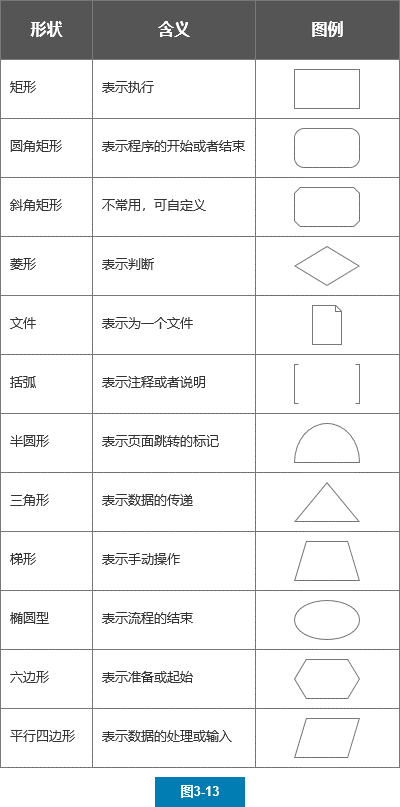
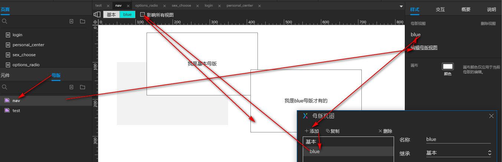
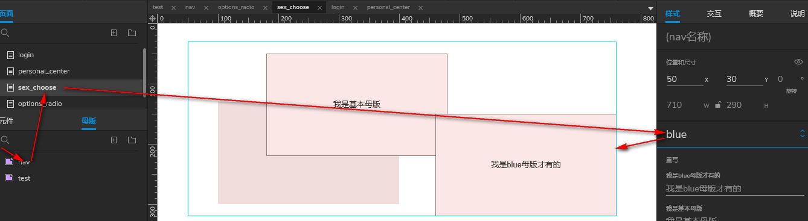
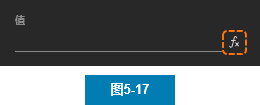
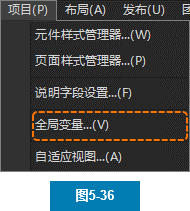
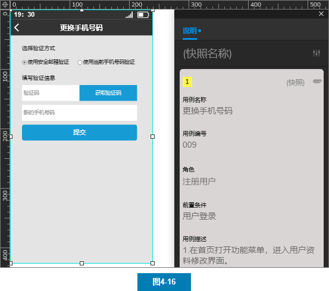

## 文件
## 编辑
## 视图
## 项目
## 元件
### 元件含义

### icon元件库
### flow元件库
### Default元件库
+ 基本元件
    + 热区
    + 内联框架  
内联框架用于向页面中嵌入内容
    + 动态面板  
动态面板是一个允许添加多状态（层）的容器元件

    + 中继器  
中继器是一个模拟列表的元件

+ 表单元件
+ 菜单|表格
    
+ 标记元件
    + 快照  
快照元件可以通过双击设置引用页面，呈现被引用页面的图像

### 自定义元件库
后缀为“.rplib”，可以通过元件功能面板的“+”按钮进行选择添加

### 自定义icon元件库
svg格式，拖进Axure画布  
添加字体库及web支持：http://www.iaxure.com/7057.html

### 对象
This：当前元件
Target：目标元件

### 属性
[[对象.属性]]
例如，我们为某个元件添加交互时，想要获取这个元件的X轴坐标，就可以使用“[[This.x]]”进行获取

## 母版
为了让页面中某一模块内容可以重复使用，并且在修改内容时能够同步更新
### 创建

### 位置
不希望母版内容在所有页面中都处于同一位置时，可以右键页面中母版，取消锁定母版中的位置。  也可以通过拖入母版到页面编辑区的方式，进行自由的摆放

### 使用

## 样式
## 交互
### 值的运算
+ 公式格式
例：[[3*5]]
+ 运算符    

+ 变量
    + 系统变量
    + 自定义变量
        + 全局变量   
在原型的任何页面以及任何交互中都能够进行变量的创建、写入与读取，所以一般会被用于跨页面的数据传递  

        + 局部变量
+ 函数  
chartAt、subStr...

## 说明

