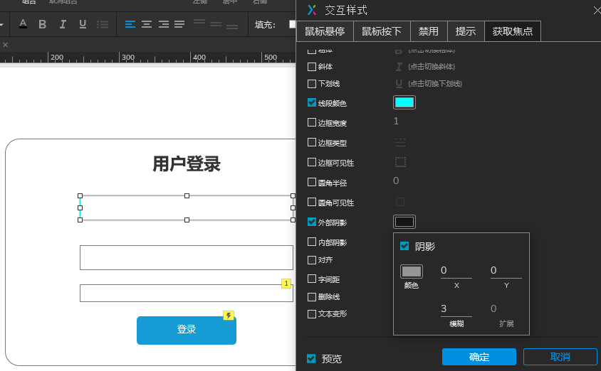
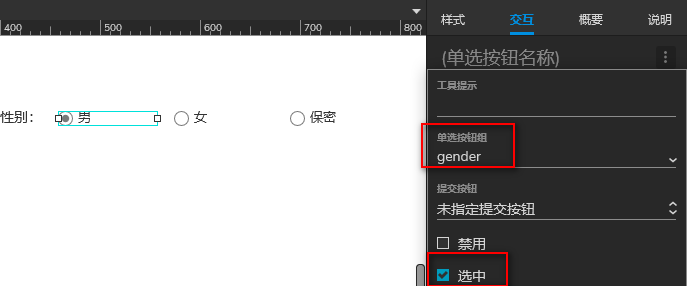
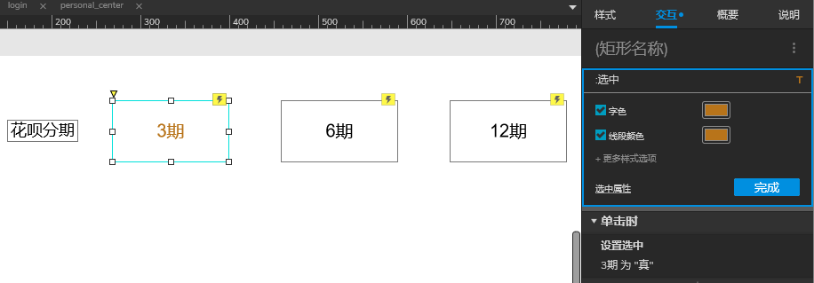
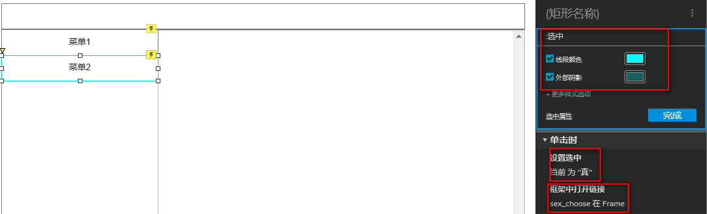
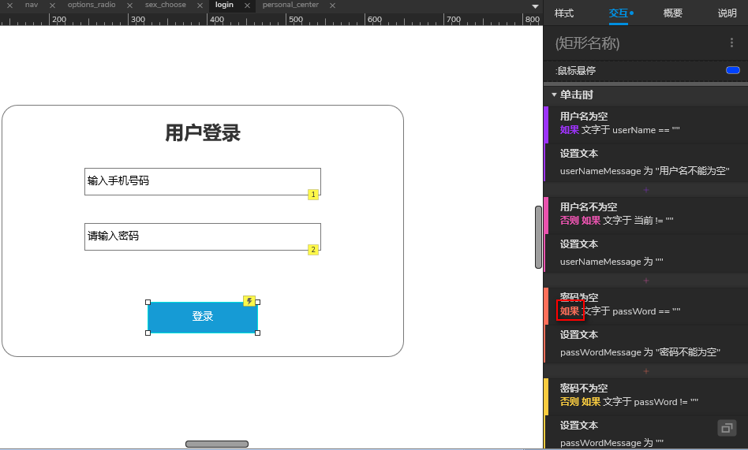
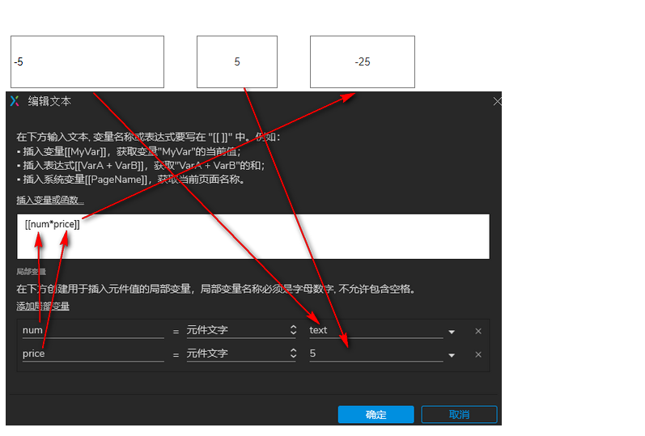
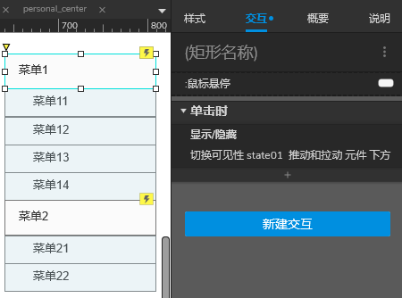

## 光标进入时边框颜色变为蓝色的文本框
1. 选中文本框
2. 交互，新建交互，交互样式，获取焦点
3. 设置边框颜色，外部阴影

## 单选组
 
 
 
## 内联菜单

## 登录判断
  
我们还需要在密码为空”的情形上点击鼠标右键，上下文菜单中选择最后一项【切换为[如果]或[否则]】  

## 函数计算
  

## 二级下拉菜单
[http://www.iaxure.com/7398.html](http://www.iaxure.com/7398.html)  
