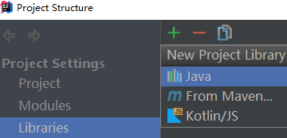
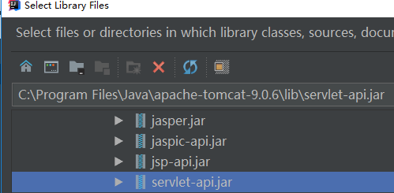

 # 依赖
 ## 方式一
 ```xml
<dependencies>
    <dependency>
        <groupId>javax.servlet</groupId>
        <artifactId>servlet-api</artifactId>
        <version>3.1.0</version>
        <scope>provided</scope>
    </dependency>
    
    <dependency>
        <groupId>javax.servlet.jsp</groupId>
        <artifactId>jsp-api</artifactId>
        <version>2.1</version>
        <scope>provided</scope>
    </dependency>
</dependencies>
```

## 方式二
选择容器的servelt实现  
  
  
选择jar包后选择项目，点击Ok  