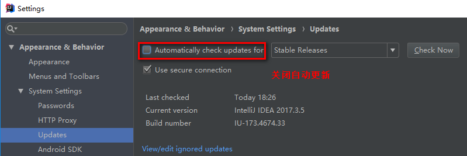

## 当前设置和全局设置


## 系统设置


## 控制台乱码
第一步:修改intellij idea配置文件：  
找到intellij idea安装目录，bin文件夹下面idea64.exe.vmoptions和idea.exe.vmoptions这两个文件，分别在这两个文件中添加：-Dfile.encoding=UTF-8
有时也需要修改pom.xml 中的编码格式  
```xml
<project.build.sourceEncoding>GBK</project.build.sourceEncoding>
```
第二步：找到intellij idea的file---settings---Editor---FileEncodings的GlobalEncoding和ProjectEncoding和Default encoding for properties都配置成UTF-8  
第三步：在部署Tomcat的VM options项中添加：-Dfile.encoding=UTF-8  
第四步：重启Intellij idea即可解决乱码问题  

## 自动导包


## 关闭自动更新


## 主题字体


## 编辑界面字体大小


## 控制台日志数量


## 隐藏.idea文件夹和.iml等文件


## 修改代码自动保存


## 大小写敏感

使得修改项目文件时相应的父级目录也有变色指示，方便查找修改文件


## 用Idea生成实体类(hibernate)


## 用Idea生成实体类(Mybatis)
[https://segmentfault.com/a/1190000009058867]()  
配置等…  

 
## Debug调试

+ F8下一步
+ F7进入方法体
+ shift+F8跳出方法
+ F9到下一个断点或完成执行

## 修改编译的jdk版本
File --> project Structure --> Modules 路径


File --> Settings --> Build,Execution,Deployment --> Compiler --> java Compiler 路径：


### pom.xml中修改
```xml
<!-- 编译JDK版本 -->
<build>
  <plugins>
    <plugin>
      <artifactId>maven-compiler-plugin</artifactId>
      <version>3.1</version>
      <configuration>
        <source>1.8</source>
        <target>1.8</target>
      </configuration>
    </plugin>
  </plugins>
</build>
```

## 自动编译


 
## 代码提交设置
  

## 代码更新设置
如何显示可更新文件列表?
