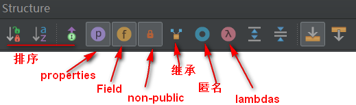

### 删除当前行
Ctrl+Y

### 代码上/下移
shift+alt +↑/↓

### 重写方法
Ctrl+O

### 类或接口的继承关系
Ctrl+H

### 类中的所有方法
Alt+7

### 查找类
Ctrl+N

### 手动导包
Alt + Enter 

### 代码格式化
Ctrl+alt+L

### 复制
ctrl+c

### 粘贴
ctrl+v

### 从复制历史中粘贴
ctrl+shift+v

### 剪切行
Ctrl+X

### 复制当前行
Ctrl+D

### 替换本页内容
ctrl+r

### 多个文件中替换内容
ctrl+shift+r

### 覆盖父类方法
alt+ins

### 注释（//或者/**/）
Ctrl+/或Ctrl+Shift+/

### 自动代码（例如：serr）
Ctrl+J

### 查找接口的实现类
ctrl + alt +B

### 查找代码所在位置
Alt+F1

### 整合多行到一行
Ctrl+Shift+J

### 向下插入新行
Shift+Enter

### 全局查找
Ctrl+Shift+F

### 定位行
Ctrl+G

