## 创建java项目
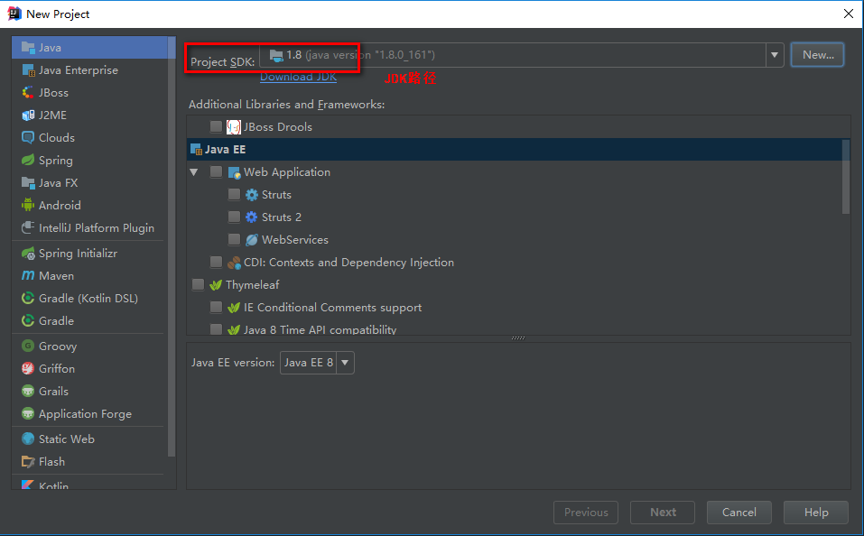  
接下来参考  
> jetBrains_intelllij-idea/005.界面及功能.md:1

## 创建java多模块maven项目
1. 创建父模块  
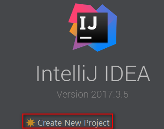
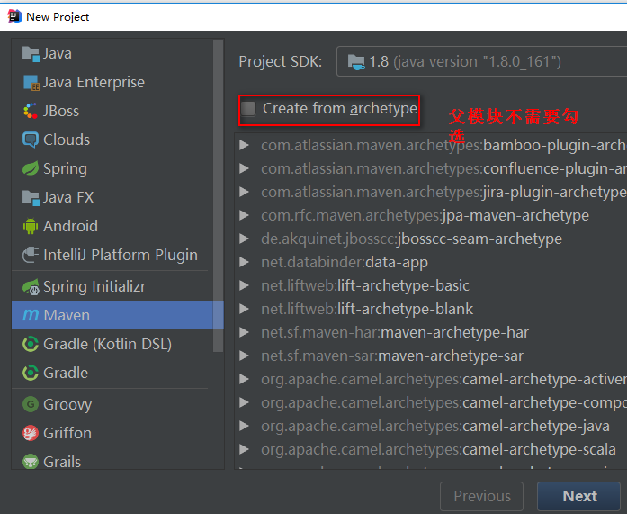
接下来参考  
> jetBrains_intelllij-idea/005.界面及功能.md:1
2. 目录结构创建好后，直接删除src文件夹，因为该项目是作为一个Parent project存在
如果不是web模块，将项目结构中此模块的web删除。 在目录结构下将webapp文件夹删除，添加java文件夹，并在项目结构中标记其类型。 在pom.xml中更改为<packaging>jar</packaging>  
3. 添加模块  
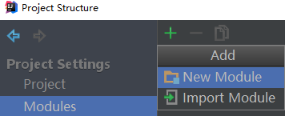   
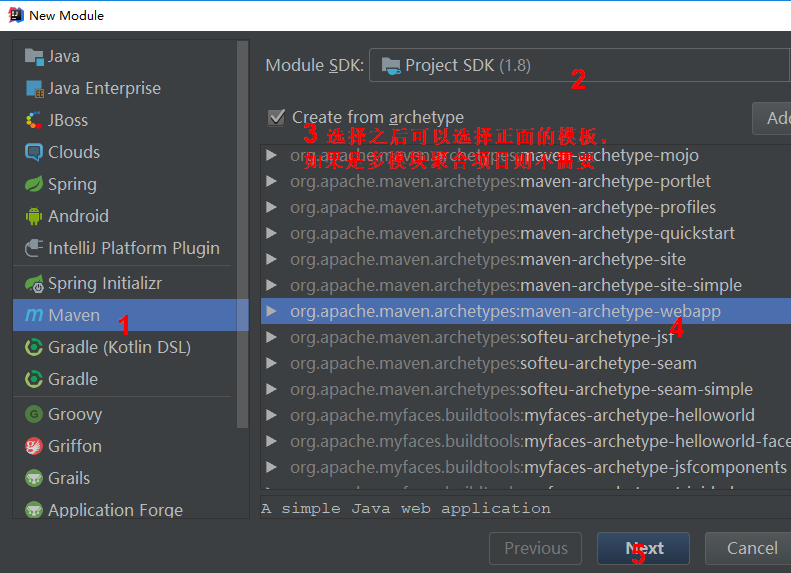   
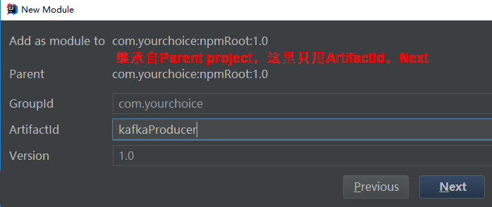   
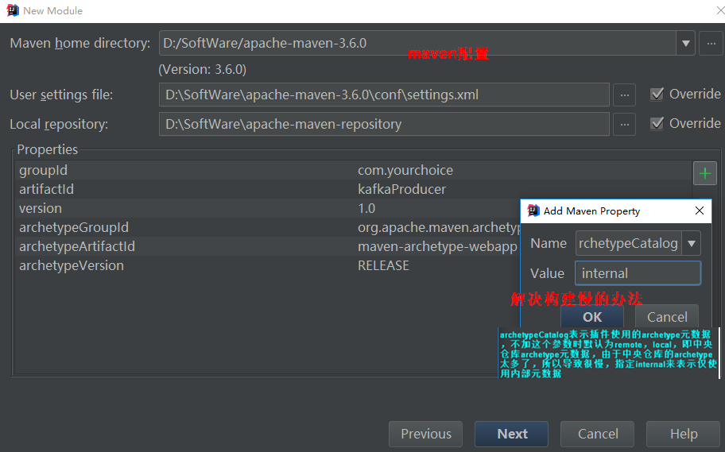   
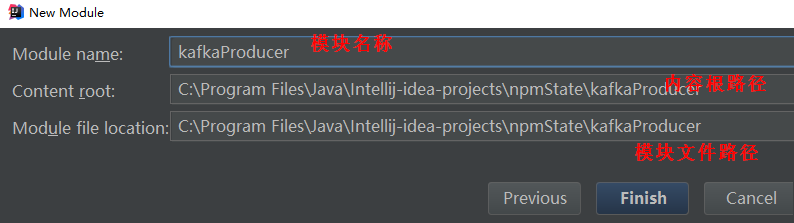  
***如果是非web项目***  
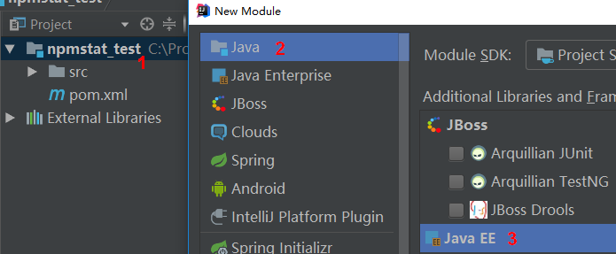  

4. 更改配置
+ pom依赖
+ module
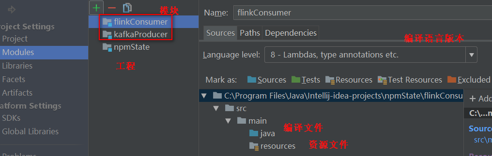    
+ 目录结构

## 导入并部署maven项目
### 导入项目
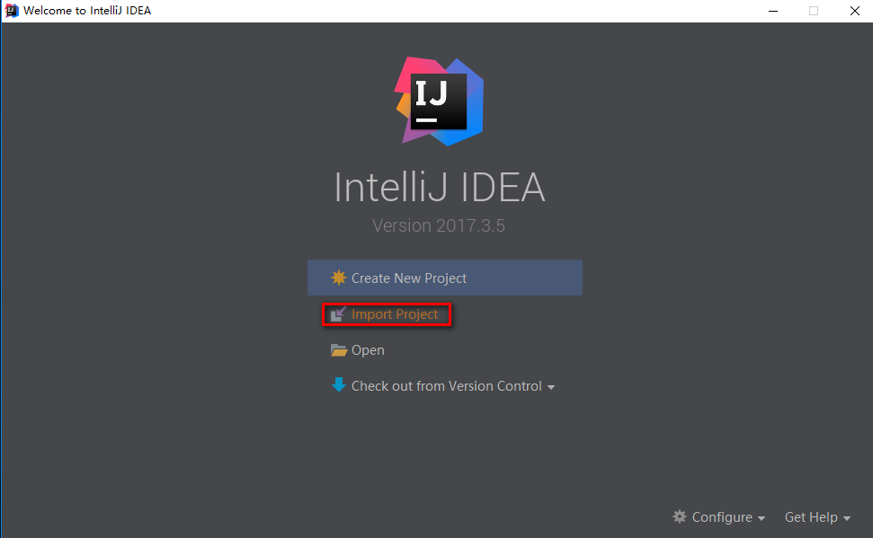    
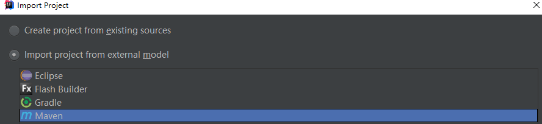     
基本默认配置,next->Ok  
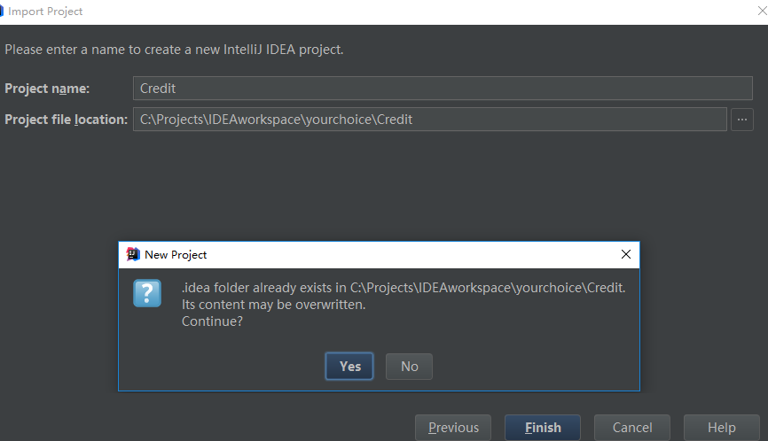  
### 修改成自己的maven配置
参考：  
> jetBrains_intelllij-idea/008.关联Maven.md:1
### Web配置并打包
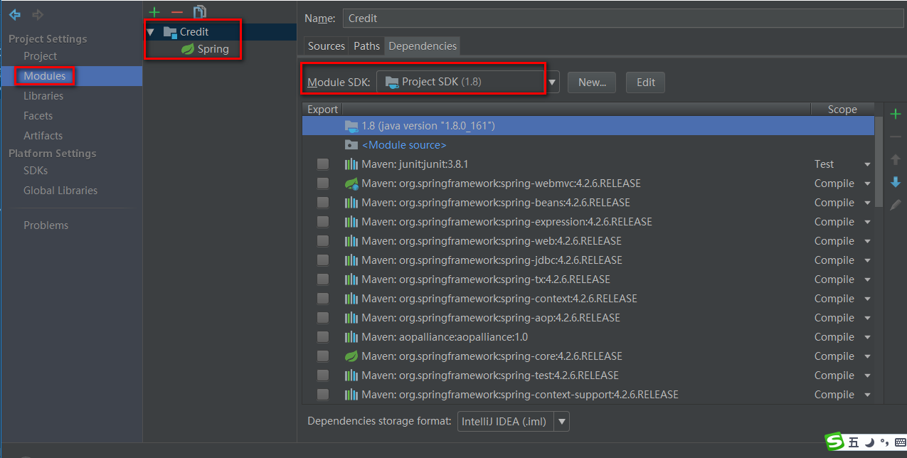  
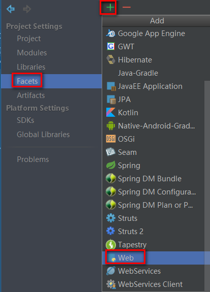  
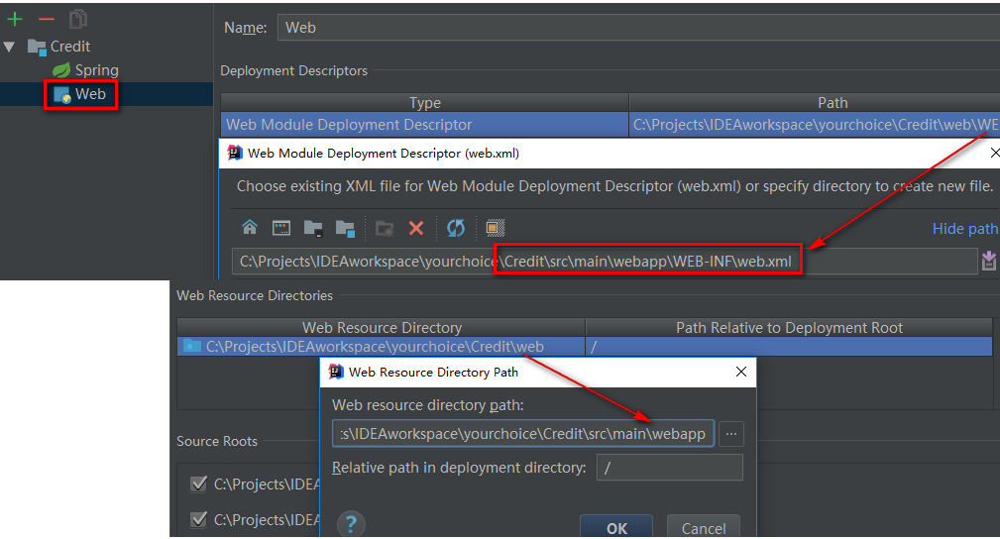  
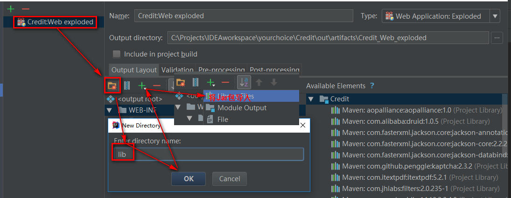   
### 部署server
参考：
> jetBrains_intelllij-idea/007.关联容器.md:1

### 将普通项目改造为Maven项目
1. 右键项目
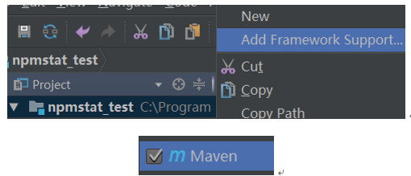 
2. 修改pom文件 
pom参考格式如下：  
```xml
<?xml version="1.0" encoding="UTF-8"?>
<project xmlns="http://maven.apache.org/POM/4.0.0"
         xmlns:xsi="http://www.w3.org/2001/XMLSchema-instance"
         xsi:schemaLocation="http://maven.apache.org/POM/4.0.0 http://maven.apache.org/xsd/maven-4.0.0.xsd">
    <parent>
        <artifactId>iTLearning</artifactId>
        <groupId>org.ddzj</groupId>
        <version>0.0.1-SNAPSHOT</version>
    </parent>
    <modelVersion>4.0.0</modelVersion>

    <artifactId>moudleName</artifactId>

    <dependencies>
    </dependencies>
</project>
```
3. 添加依赖关系
 
## 删除项目
1. close项目
2. 从本地删除项目
3. 再次打开从列表移除项目

## 部署应用后的位置
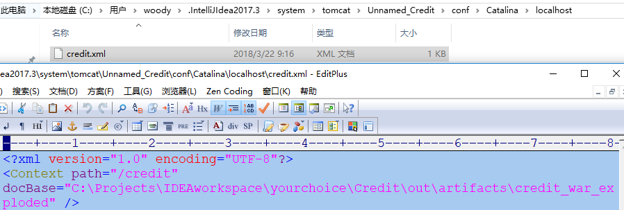  

