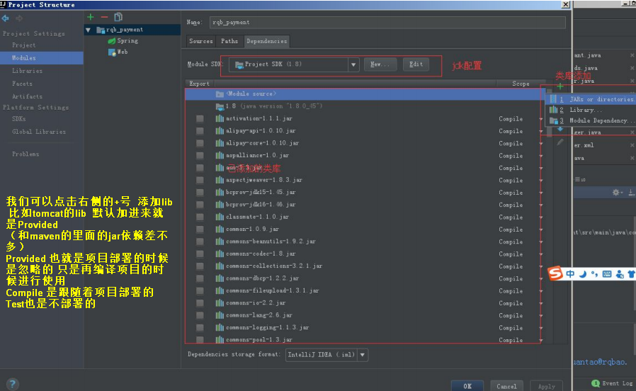
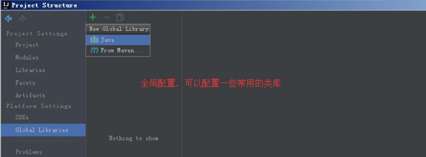

## new project
### 项目路径

## project structure

### modules
项目模块，有整个项目模块的配置和 web、Spring 级别的。  
Web 级别是基础，可以配置 web.xml，web 目录，以及创建 artifact（第一次项目的时候需要配置此处）  
1. 创建新模块  
  
2. 模块信息  
  
3. 存放路径   
   
但项目中两个模块不能共享同一个配置路径  

#### Sources

#### Paths

#### Dependencies

### Libraries（类库）
类库，项目依赖的类库  

### Facets（特征）
表示这个 module 有什么特征，比如 Web，Spring 和 Hibernate 等  

### ArtiFacts（打包）
Artifact 是 maven 中的一个概念，表示某个 module 要如何打包，例如 war exploded、war、jar、ear 等等这种打包形式；    
一个 module 有了 Artifacts 就可以部署到应用服务器中了！      
在给项目配置 Artifacts 的时候有好多个 type 的选项，exploed 是什么意思：  
explode 在这里你可以理解为展开，不压缩的意思。也就是 war、jar 等产出物没压缩前的目录结构。建议在开发的时候使用这种模式，便于修改了文件的效果立刻显现出来。  
默认情况下，IDEA 的 Modules 和 Artifacts 的 output 目录 已经设置好了，不需要更改，打成 war 包 的时候会自动在 WEB-INF 目录 下生产 classes 目录 ，然后把编译后的文件放进去。  

### SDK（系统开发工具）
全局 SDK 配置  

### Global libraries（全局类库）

### Problems（问题）
问题，在项目异常的时候很有用，可以根据提示进行项目修复（FIXED）  

## File
### 打开多个项目
  

## 文件错误删除，打开本地历史恢复
  

## 清理缓存并重启
file -> Invalidate Caches/Restart

## 打开报插件错误
   
打开idea，到settings->plugins，找到所有加载错误的插件（标红的），去勾选，点击apply之后，重启idea。此时，还是会报上述的错误。接下来，还是到settings->plugins，把刚才因为加载错误被去勾选的插件再勾上，apply，再重启一次idea。

## 编辑器自动换行

## 在项目结构中定位到当前编辑的文件

## 添加jar包后启动项目报NoClassDefFoundError
首先确保jar包在libraries中出现，有的话在项目结构的Artifacts中将war包重新编译，在容器中重新部署即可  
