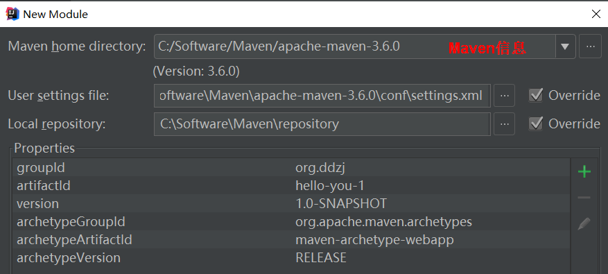

## new project
### 项目路径

## project structure
### 创建新模块

### 模块信息

### Maven配置

### 存放路径 
  
但项目中两个模块不能共享同一个配置路径  

## 打开多个项目
  

## 文件错误删除，打开本地历史恢复
  

## 清理缓存并重启
file -> Invalidate Caches/Restart

## 打开报插件错误
   
打开idea，到settings->plugins，找到所有加载错误的插件（标红的），去勾选，点击apply之后，重启idea。此时，还是会报上述的错误。接下来，还是到settings->plugins，把刚才因为加载错误被去勾选的插件再勾上，apply，再重启一次idea。

## 编辑器自动换行

## 在项目结构中定位到当前编辑的文件

## 添加jar包后启动项目报NoClassDefFoundError
首先确保jar包在libraries中出现，有的话在项目结构的Artifacts中将war包重新编译，在容器中重新部署即可  
