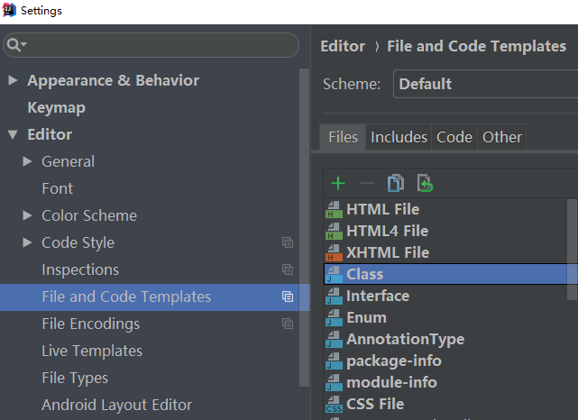
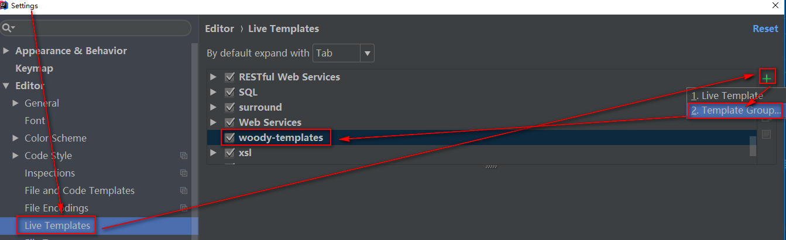
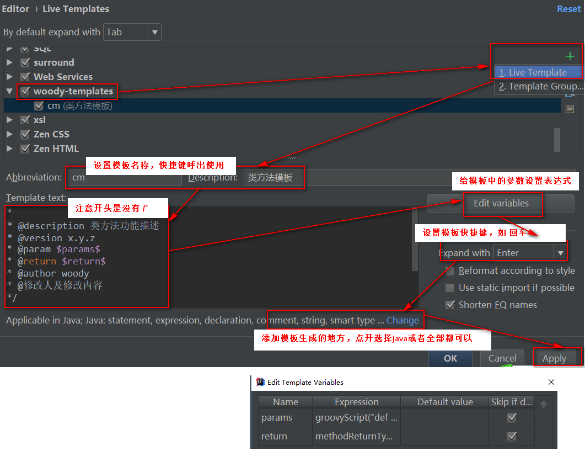

# 修改注释模板

```java
/**
  * Copyright (C), 2015-${YEAR}, 西安优卓软件有限公司
  * FileName: ${NAME}
  * Author:   ${USER}
  * Date:     ${DATE} ${TIME}
  * Description: ${DESCRIPTION}
  * Version: ${VERSION}
  */
#if (${PACKAGE_NAME} && ${PACKAGE_NAME} != "")package ${PACKAGE_NAME};#end  
#parse("File Header.java")
```

public class ${NAME} {}

# 自定义代码注释模板
## 新建注释模板组


## 新建模板


### 模板参数的传入参数表达式：

groovyScript("def result=''; def params=\"${_1}\".replaceAll('[\\\\[|\\\\]|\\\\s]', '').split(',').toList(); for(i = 0; i < params.size(); i++){result+=params[i] + ' 参数'+i+'；'}; return result", methodParameters())s

*
* @description 类方法功能描述
* @version x.y.z
* @param $params$
* @return $return$
* @author woody
* @修改人及修改内容 
*/

__使用时在方法上面输入\/*cm 回车，则呼出此注释__

## 案例二-源码注释
rc
源码注释

*
* @作用 作用描述
* 
* @原理 原理描述
* 
* @备注 备注信息
* 
* @since x.y.z
* 
* @author woody
*/