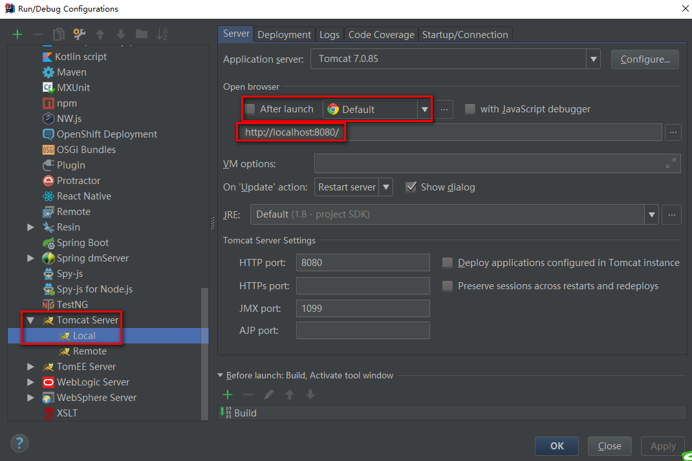
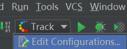
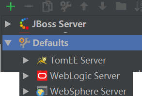

## 关联Tomcat

## 关联JBoss
cluster.war文件是一个很简单的web项目，唯一不同的是项目内的web.xml文件中多了一行<distributable/>，这个标记会开启jboss cluster功能

## 关联WebLogic
1. 编辑配置  
  
2. 第一次使用，add中可能没有WebLogic配置，Defaults中添加  
  
配置安装路径，domains用户名密码  
3. add new configuration，选择WebLogic即可  
