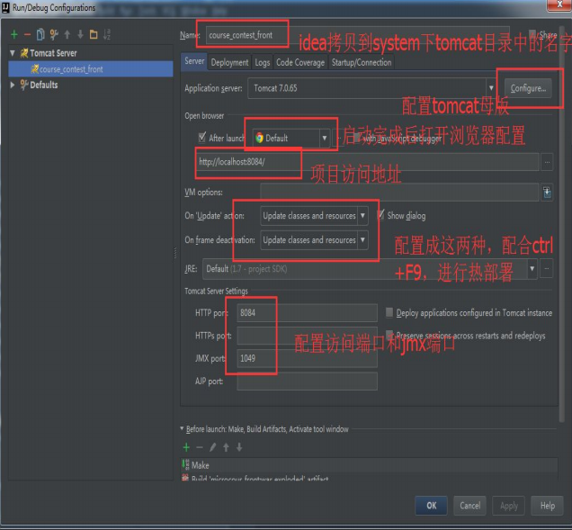

# VM options配置说明
## jdk1.8推荐
```text
-Dfile.encoding=UTF-8 -Xms768m -Xmx1024m -XX:MetaspaceSize=128m -XX:MaxMetaspaceSize=512m -Xloggc:C:\Users\woody\Desktop\gc.log -XX:+PrintGCDateStamps -XX:+PrintGCDetails
```

## jdk1.7推荐
```text
-Dfile.encoding=UTF-8 -Xms768m -Xmx1024m -XX:PermSize=128m -XX:MaxPermSize=512m  -Xloggc:C:\Users\woody\Desktop\gc.log -XX:+PrintGCDateStamps -XX:+PrintGCDetails
```

# 关联Tomcat
  
  
  
  

## Tomcat集成原理
### 部署应用后的位置
用户为项目配置了 tomcat 后，idea 会拷贝一份配置到系统目录中，如下    
  
### Conf（配置）
此处的端口和项目都和前边配置的一致  
  
Tomcat 之所以可以 root 启动和热部署，原因在如下  
  
### Logs
可以查看项目日志，在控制台日志无法查询到的时候，可以来到此目录查看  
  
### Work
存放编译的 class 和 jsp  
  


# 关联JBoss
cluster.war文件是一个很简单的web项目，唯一不同的是项目内的web.xml文件中多了一行<distributable/>，这个标记会开启jboss cluster功能

# 关联WebLogic
1. 编辑配置  
  
2. 第一次使用，add中可能没有WebLogic配置，Defaults中添加  
  
配置安装路径，domains用户名密码  
3. add new configuration，选择WebLogic即可  
