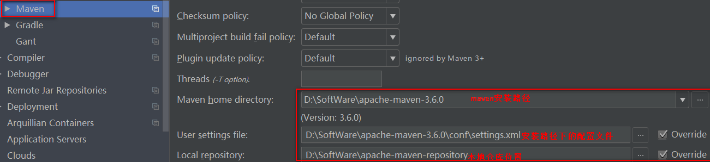
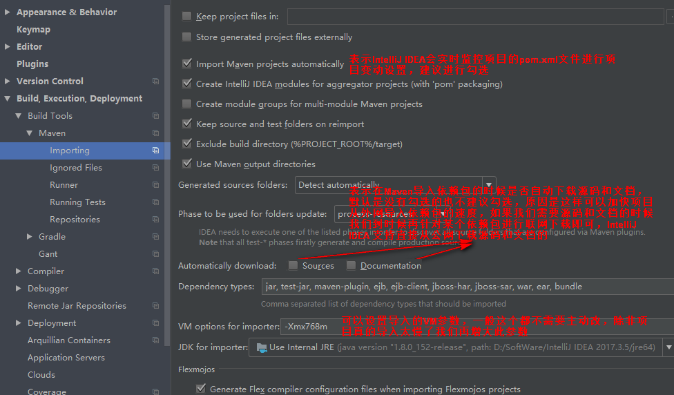
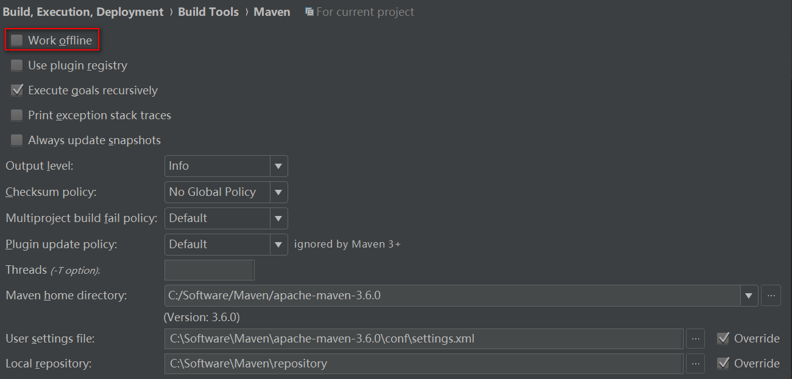
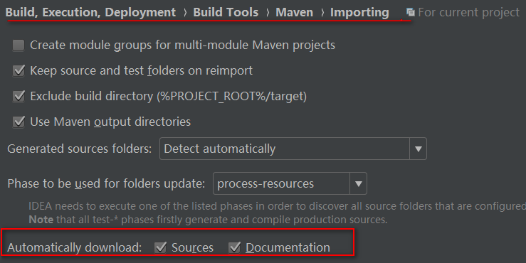

## Maven配置
内嵌的版本大概是某个特定版本的，自己安装可以安装最新的maven版本或任意版本  
  
  
离线模式  
需要自动导包则不要打勾  
  

## 查看jar依赖
### 方式一


### 方式二

  
要排除某个jar依赖，在jar上右键，Exclude即可  


## 修改JDK编译版本
maven项目会用maven-compiler-plugin默认的jdk版本来进行编译，如果不指明版本就容易出现版本不匹配的问题，可能导致编译不通过的问题。  
### 解决方式一
```xml
<properties>
     <maven.compiler.target>1.8</maven.compiler.target>
     <maven.compiler.source>1.8</maven.compiler.source>
</properties>
```
### 解决方式二
```xml
<build>
    <plugins>
      <plugin>
         <groupId>org.apache.maven.plugins</groupId>
         <artifactId>maven-compiler-plugin</artifactId>
         <version>3.6.1</version>
         <configuration>
            <source>1.8</source>
            <target>1.8</target>
         </configuration>
      </plugin>
  </plugins>
</build>
```

## 自动下载源码和文档
  