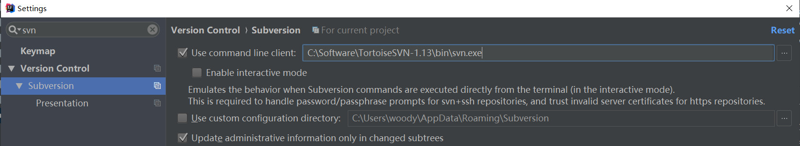
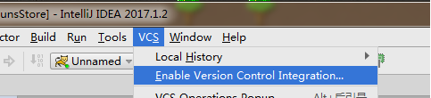
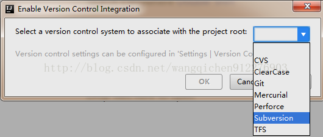
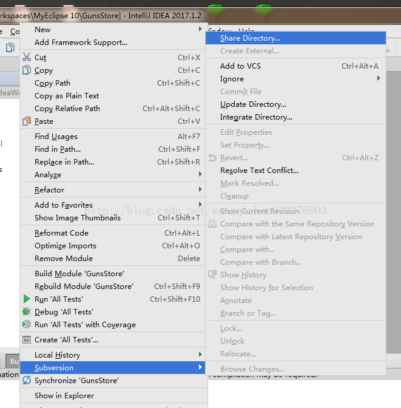
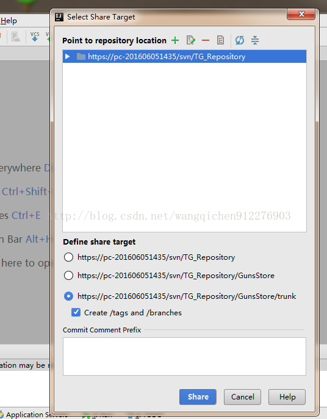
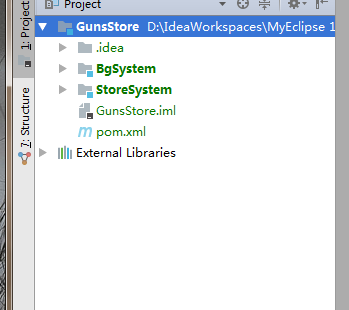
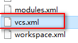

## 将项目交给svn管理
1. 关联svn插件
   

2. 打开IDEA ，上面工具栏选择VCS 选择把项目交给SVN管理  
   

3. 选择SVN  
   
   

4. 点击绿色的+号，选择一个SVN仓库的地址，下面可以选择上传到SVN仓库的目录格式，然后点击Shard  
  
 
5. 之后项目就会变成绿色  
  

6. 点击提交  

## 移除svn项目管理
    
将此文件删除即可  