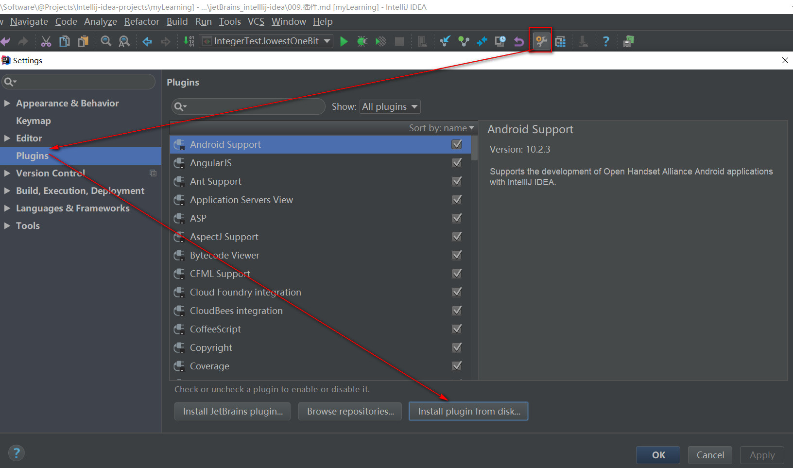
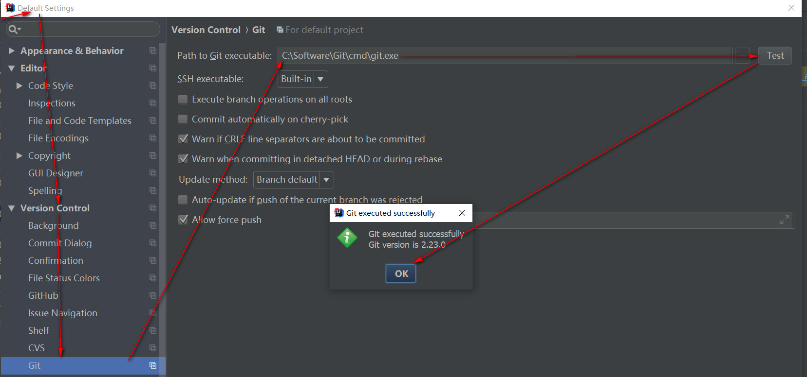
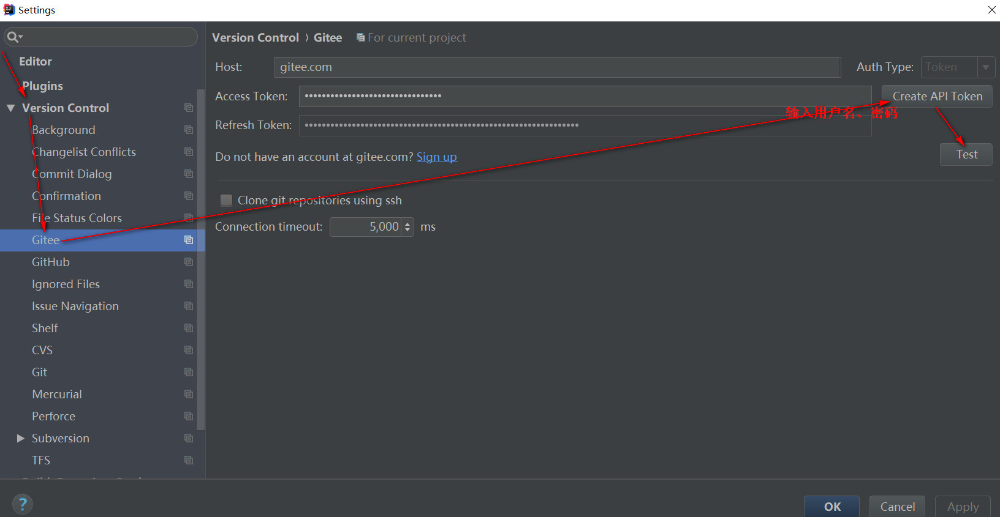
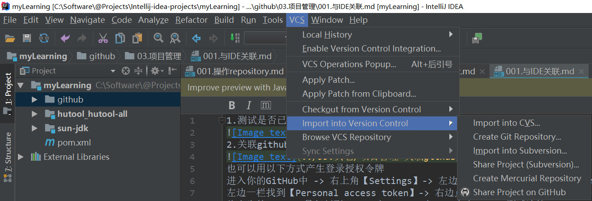
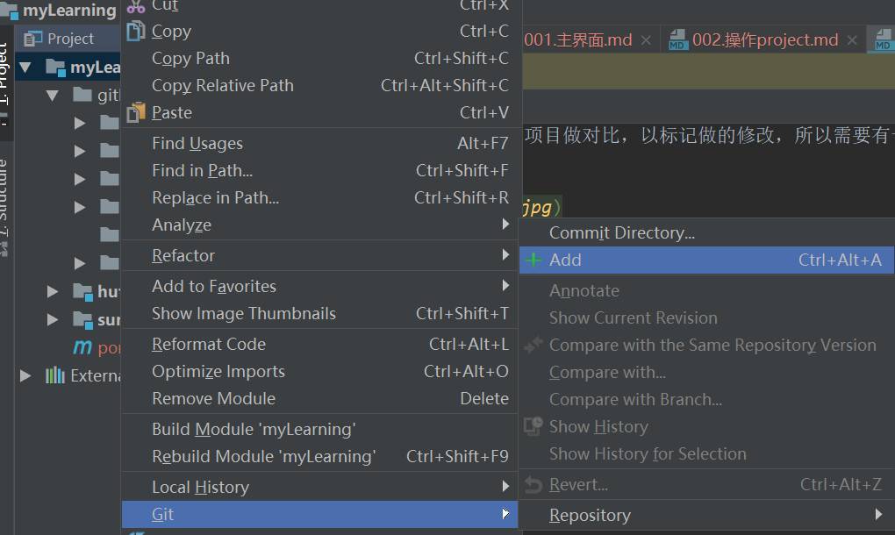
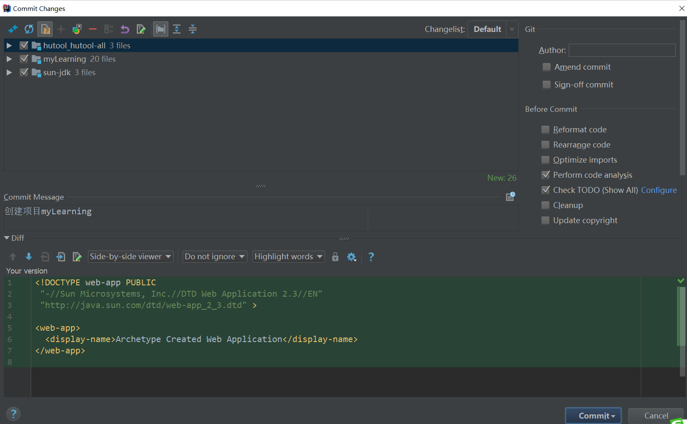
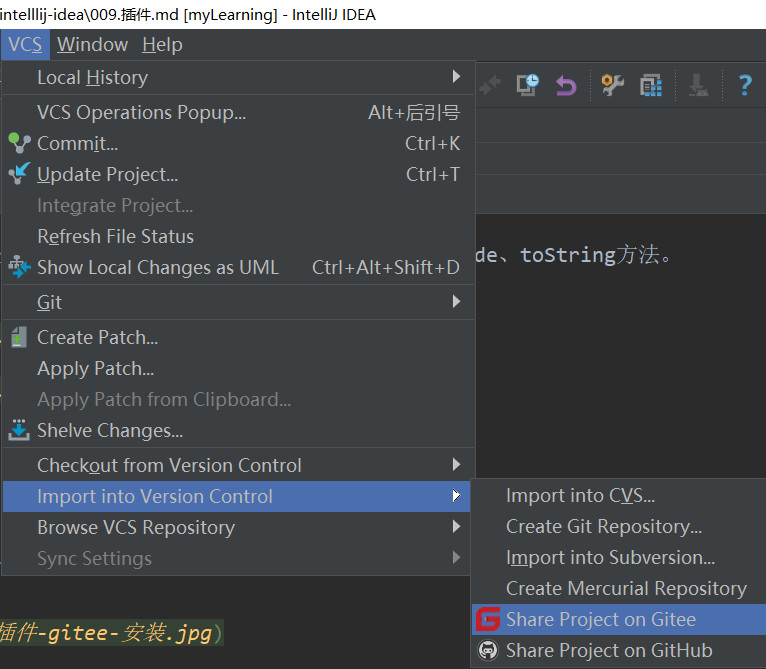

## gitee
### 下载插件  
下载idea对应版本的插件  
[https://plugins.jetbrains.com/plugin/8383-gitee/versions]()  

### 安装插件

### 测试是否已安装git

### 关联gitee账号

### 创建本地仓库，VCS -> Import into Version Control -> Create Git Repository**

### 在弹框中选中项目所在的位置，点击OK，此时文件会变红色（表示新增文件,还未上传至仓库）**
### 上传项目到本地仓库，项目右键选择Git -> add，此时项目文件变成绿色，然后项目右键Git--> Commit Directory,此时由从暂存区提交至版本库,项目变白色**

### 将idea项目共享至gitee

### 取消关联gitee
**非最终解决方案**
1. 删除项目的根目录下的.git文件夹  
2. 删除项目的根目录下的.idea目录下的vcs.xml文件