### 测试是否已安装git（因为你本地的项目要与github上的项目做对比，以标记做的修改，所以需要有一个版本管理的工具）
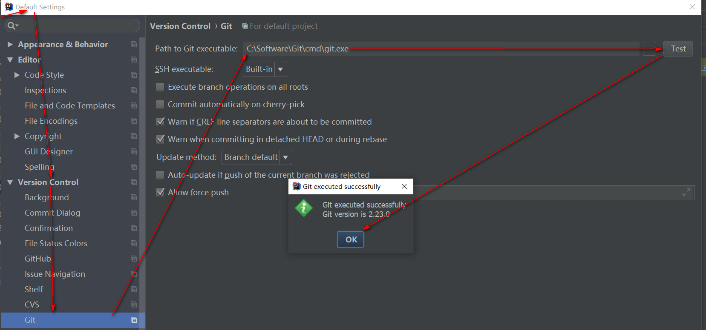

### 关联github账号
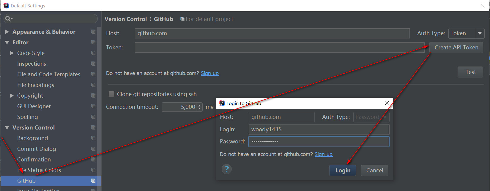
也可以用以下方式产生登录授权令牌
进入你的GitHub中 -> 右上角【Settings】-> 左边一栏找到【Developer settings】 -> 
左边一栏找到【Personal access token】-> 右边点击【Generate new token】-> 全选所有 -> 
将产生的 token 号复制到 idea 中 Token 中 -> 点击 Test 测试连接
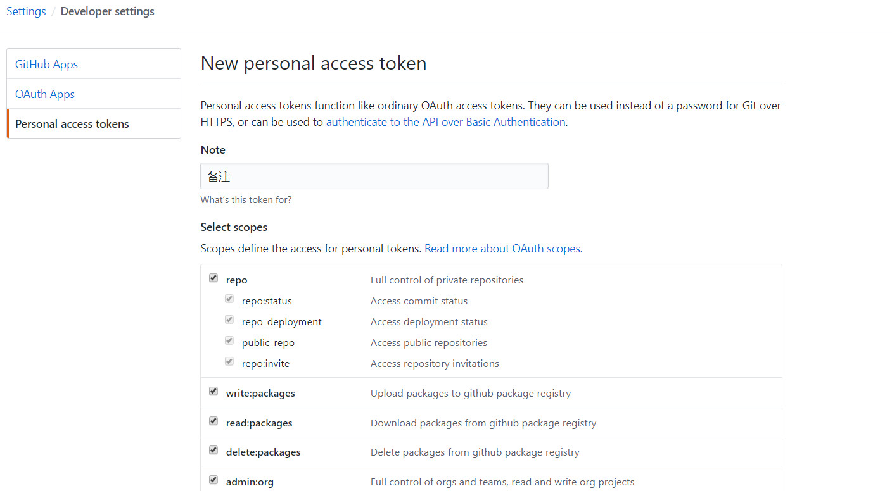

### 测试令牌
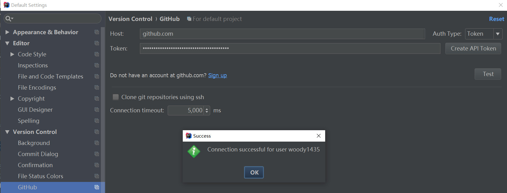

### 创建本地仓库，VCS -> Import into Version Control -> Create Git Repository**
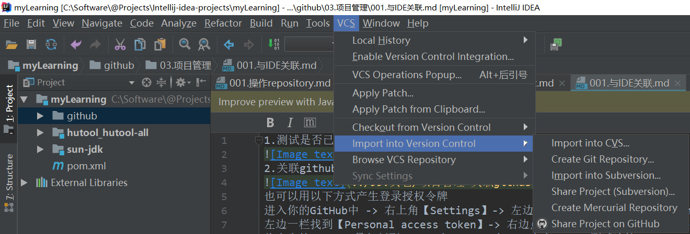

### 在弹框中选中项目所在的位置，点击OK，此时文件会变红色（表示新增文件,还未上传至仓库）**
### 上传项目到本地仓库，项目右键选择Git -> add，此时项目文件变成绿色，然后项目右键Git--> Commit Directory,此时由从暂存区提交至版本库,项目变白色**
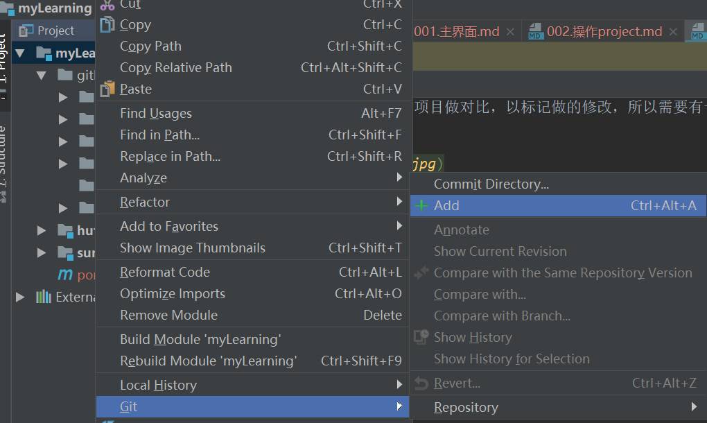

### 上传项目到GitHub中，VCS -> Import into Version Control -> Share Project on GitHub，在弹框中输入仓库名和描述，点击Share，即可是上传，中间会弹窗输入GitHub的用户名和密码（已输入过用户名和密码并记住的不会再次弹框输入），上传成功后IDEA右下角会给出提示**
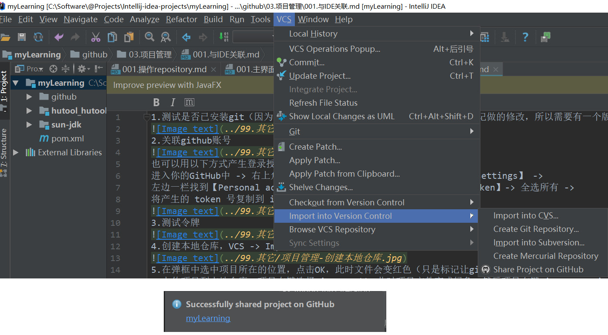

### 提交到github
**提交前需先提交至git中,github才能检测到版本差别**
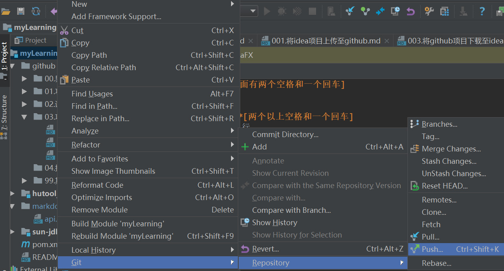  
只提交单个文件,在单个文件右键 -> git -> commit and push,整个项目提交,在项目上右键

### 从github更新
**如果此时本地相同文件也已经修改,会产生冲突**  
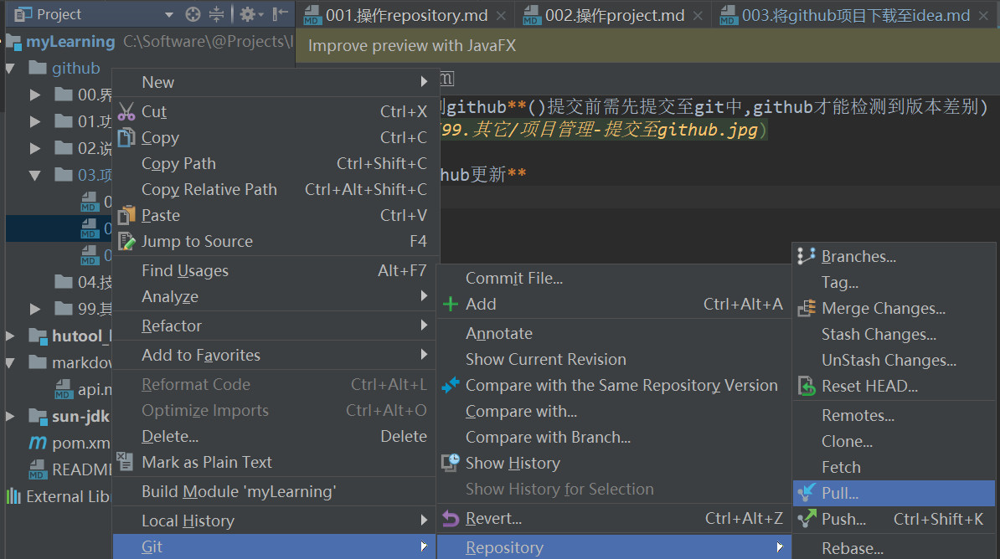  

### 冲突解决办法
**点击Merge合并冲突**  
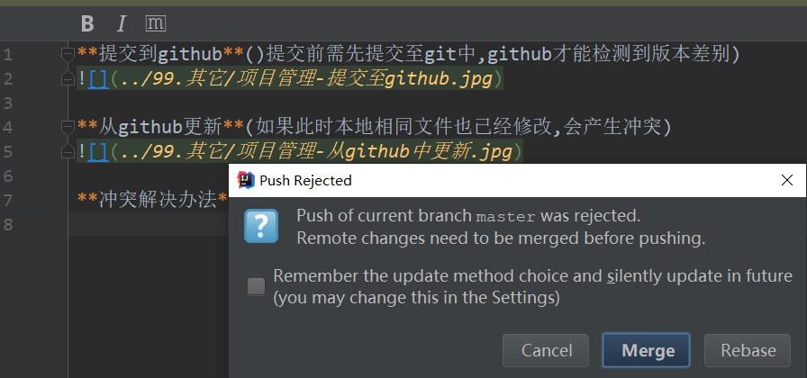  
**处理列出来的冲突文件,双击文件或Merge**  
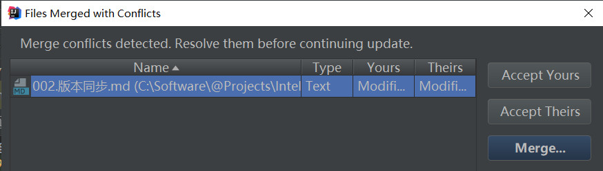  
**\>\>或<<表示采用此修改,X表示取消此修改** 
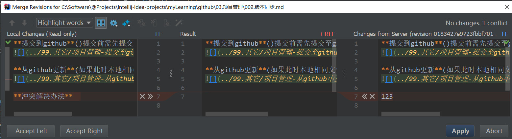  
**然后再重新push/pull**  

## 获取github上项目地址
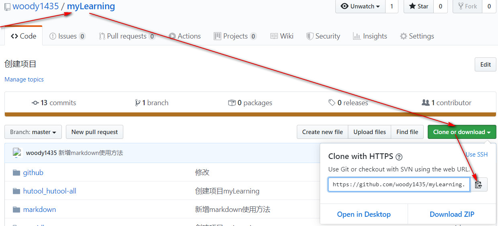   

## 在idea中导入github上项目
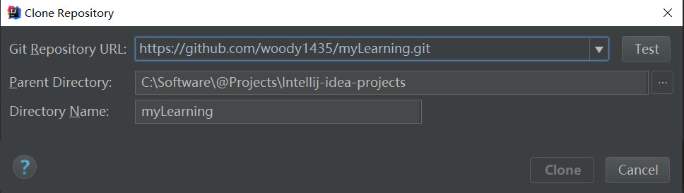