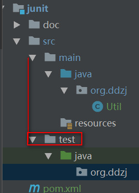
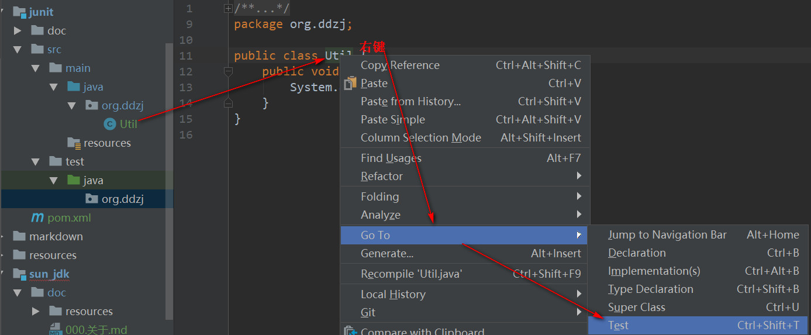
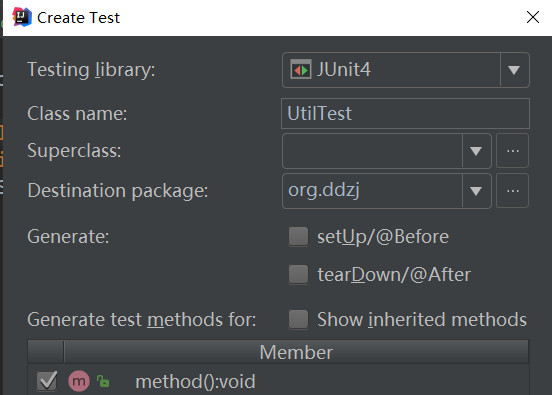
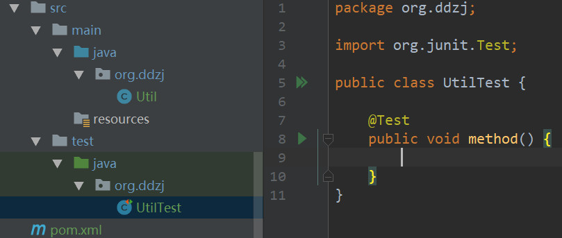

## 创建测试包
测试包路径如下：  

## 标识为测试文件夹
右键test文件夹下的java文件夹 -> test sources root（标识为测试文件目录）

## 给类添加测试
**1. 打开测试类属性面板** 

或在要测试的类上 使用 ctrl+shift+t -> Create New Test...

**2. 填写测试类存在路径，要测试的方法**

**3. 添加测试类后**
