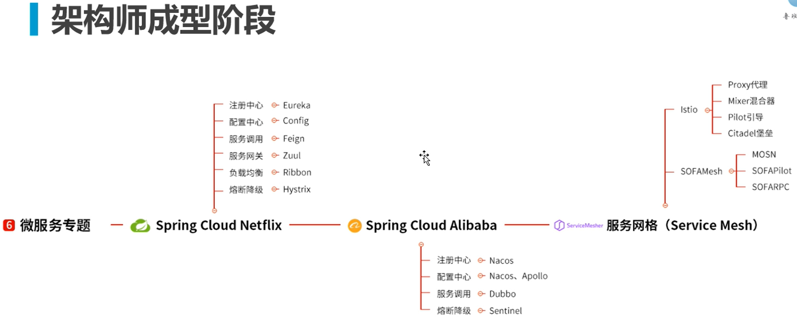

## 是什么
全称Java Development Kit (JDK)， 是Sun公司（已被Oracle收购）针对Java开发员的软件开发工具包，即开发环境，可理解为建设高楼大厦的钢筋、水泥、砖块...    

## 能做什么？
+ 嵌入式应用：家电

+ 桌面应用、游戏

+ Web应用

+ 手机操作系统

+ 其它  

+ 大数据  
+ ...  

## 特点
### 优势
+ 一次编写，到处运行：不用操心运行在什么操作系统，当我们写好一份代码后，JVM会帮我们转换成对应系统的字节码文件（比如翻译官的角色）
+ 对开发人员更友好：不用我们操心指针、垃圾回收
+ 面向对象思想
  
万事成物都可以理解成对象，要用哪个对象就取哪个对象，提高复用性，好维护，好扩展，降低各个对象的关系即耦合性，系统更加灵活

### 劣势
+ 解释型语言，调用时需要逐行解析，导致效率略低

## 具备能力
### 基础
+ 计算机入门知识
### 进阶能力
+ 英文
+ linux
+ 提问题的能力：问问题站在别人角度、耗时太长就要请教别人了
+ 搜索的能力：google、github、stack overflow

## 路线图

## 怎么学
+ 确定学习路线
+ 针对具体技术：了解其用途（解决什么问题）、用法（API）、具体应用场景（与同类产品相比的优势）
+ 学习思路（他们是怎么设计的）
+ 达到 理解、应用 目的（即 内化+熟练+创新）
+ 交流、分享（点子与点子碰撞都会产生火花）
 
+ 官网、源码、视频、博客等（多找精筛)

## 为什么要看源码
1. 更好的应用
2. 学习优秀编码（如果自己设计与他人设计会有何异同）
3. 学习设计思想（如设计模式）
4. 将精华融会贯通进自己代码
5. 内外的思想也可以影响到生活的做人做事之中

## 看不懂怎么办
想想是看不懂还是没耐心看？还是学习路线有问题？ 还是知识储备还不够？

## 常见问题
+ 瞎子不配学编程

