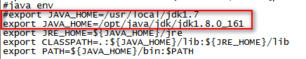

# 下载

# 命令
命令                     |  功能
------------------------|-----------------------
java -version           |   版本 

# 安装
## Windows
### 1.8
#### rpm
pm -ivh jdk-8u161-linux-x64.rpm  

#### tar
1. 将tar.gz压缩包移动到安装目录（如：/opt/jdk1.8）

## Linux
### 1.8
1. 使用weblogic用户登录
2. 切换至安装路径
    ```text
    [weblogic@gaasaewweb01l opt]$ cd /opt/java/jdk
    ```
    1. 如果没有对应文件夹，则创建
        ```text
        [weblogic@gaasaewweb01l opt]# mkdir jdk
        ```
        1. 如果无法创建，则使用root用户创建后授权给weblogic用户
            ```text
            [root@gaasaewweb01l java]# mkdir jdk
            [root@gaasaewweb01l java]# chown -R weblogic jdk
            [root@gaasaewweb01l java]# chmod -R 777 jdk
            ```
3. 使用winScp等工具上传安装包jdk-8u161-linux-x64.tar.gz  
4. 切换至安装包了路径，执行安装命令
会默认安装到当前路径  
    ```text
    [weblogic@gaasaewweb01l jdk]$ tar -xvf jdk-8u161-linux-x64.tar.gz
    ```   
5. 配置环境变量  
方式一：  
    ```text
    vi /etc/profile
    ```
修改内容如下：  
  
使环境变量生效：  

```text
[root@gaasaewweb01l weblogic]# source /etc/profile
```

方式二：  
```text
vi ~/.bashrc 
或
vi ~/.bash_profile
```
修改内容如下：  
```text
JAVA_HOME=/opt/java/jdk/jdk1.8.0_161
CLASSPATH=$JAVA_HOME/lib:$JAVA_HOME/jre/lib
PATH=$PATH:%JAVA_HOME/bin:$JAVA_HOME/jre/bin
export PATH CLASSPATH JAVA_HOME
```
使环境变量生效：  
```text
[weblogic@gaasaewweb01l ~]$ source ~/.bashrc
[weblogic@gaasaewweb01l ~]$ source ~/.bash_profile
```
6. 检测是否生效
```text
java -version
```