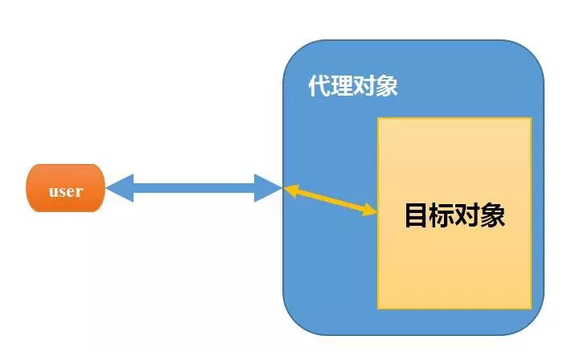

## 方式
### 继承
子类通过extends关键字继承父类的非private属性和方法

#### 好处
子类可以复用父类代码，不写任何代码即可具备父类的属性和功能，而只需要增加特有的属性和行为

#### 坏处
1. 继承破坏封装，子类与父类之间紧密耦合，子类缺乏独立性。 那组合就不会吗？？？  
   封装就是隐藏实现细节。使用者只需要关注怎么用，而不需要关注内部是怎么实现的。实现细节可以随时修改，而不影响使用者。没有封装，代码之间到处存在着实现细节的依赖，则构建和维护复杂的程序是难以想象的(可能因为重写而导致实现子类和基类实现不一致)。
2. 继承没有反映"is-a"关系
3. 还有什么？？？
### 组合

###代理
通过代理对象访问目标对象，这样可以在目标对象基础上增强额外的功能，如添加权限，访问控制和审计等功能

```java
public class Member {
    public static void main(String[] args) {
        Proxy proxy = new Proxy();
        System.out.println("代理说一个药丸十五块");
        proxy.buy(15);
    }
}

class Proxy {
    private Shop shop = new Shop();
    public void buy(int money) {
        System.out.println("一个药丸十五块");
        shop.sale(money - 5);
    }
}

class Shop {
    public void sale(int money) {
        System.out.println("一个药丸十块钱");
    }
}
```
## 如何选择复用方式
如果新类和已有类需要具有一些相似的方法和属性时，就采用继承的形式；如果新类只是为了借用已有类的一些方法和属性时，而两者没有很多相似之处时就需要采用组合的形式。

## 封装
封装就是把抽象的数据和对数据进行的操作封装在一起，数据被保存在内部，程序的其他部分只有通过被授权的操作（成员方法）才能对数据进行操作。

## 抽象
我们在定义一个类的时候，实际上就是把一类事物的公有的属性和行为提取出来，形成一个物理模型，这种研究问题的方法称为抽象

## 多态
所谓多态，就是指一个引用（类型）在不同情况下的多种状态，你也可以这样理解：多态是指通过指向父类的指针，来调用在不同子类中实现的方法

### 重载
+ 在同一个类中；  
+ 形参不同；  

### 覆盖/重写
@Override
子类中重新定义方法体

### 向上转型