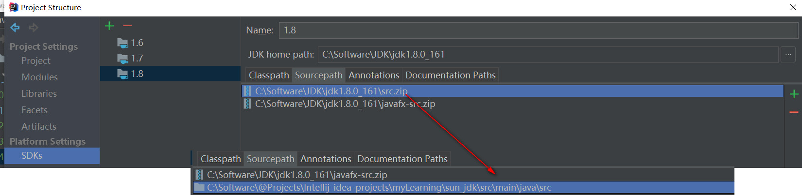
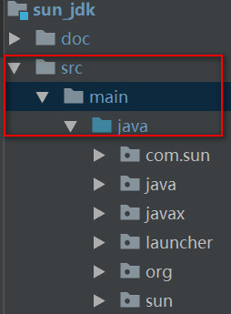
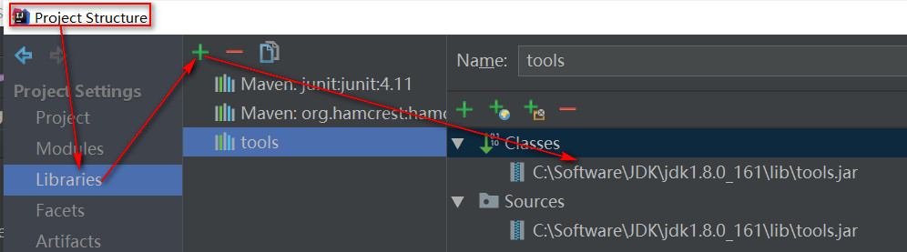
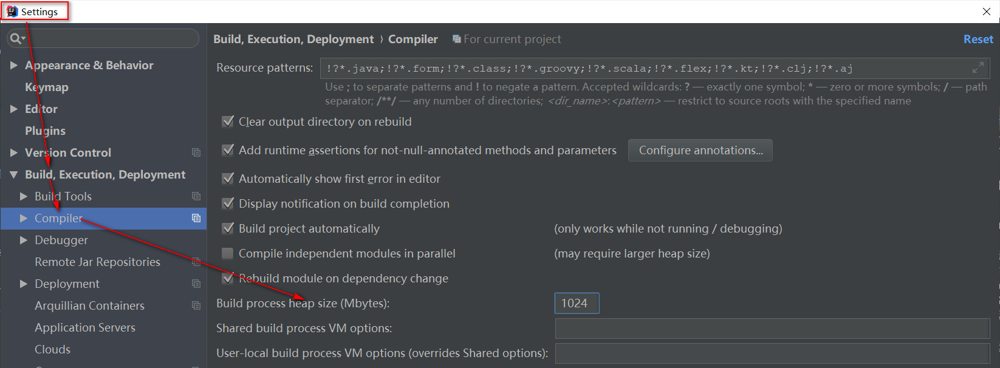
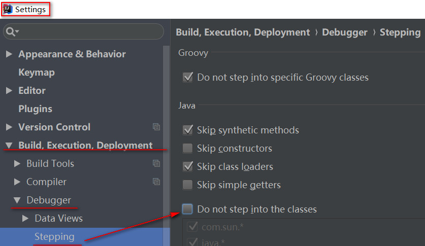
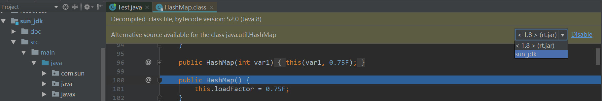
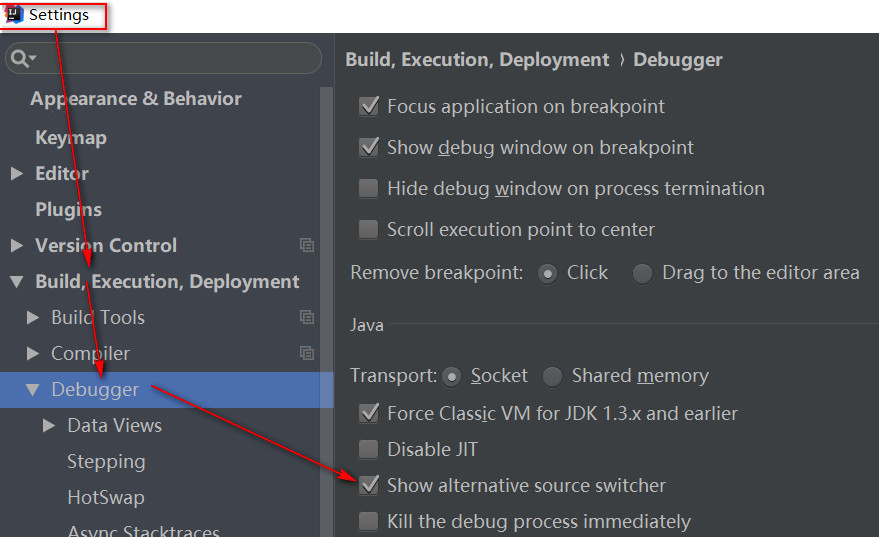

## 添加jdk源码  
1.找到%jdk_home%\jdkx.y.z\src.zip（本人jdk版本1.8.0_161）  
2.解压后放入自己项目中  
    此时debug调试可跟踪进源码中  
3.实现源码中添加注释  
    点击idea project structure -> SDKs -> 选中对应版本jdk -> Sourcepath选项卡 -> 移除掉原来的src.zip -> 将解压后引入项目的源码路径添加进来 -> 保存即可
      
    

## 问题
### 引入项目路径
  
***否则可能会导致源码中类导入失败，部分会指向jdk的相关jar包***

### 缺少com.sun.tools包

### 缺少sun.awt.UNIXToolkit等包
github上搜索 jdk 1.8 源码相关项目（或到本人github jdk源码项目（本人版本1.8.0_161）下载对应文件 https://github.com/woody1435/myLearning/tree/develop/sun_jdk）

### 编译过程中报java:OutOfMemory，提示系统资源不足  

### debug无法进入源码设置  

### debug该类替代源选择  

### 提示Alternative source availble for the class xxxx 时误点了disable的设置

