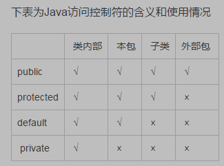
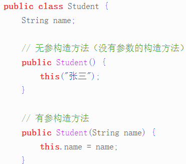
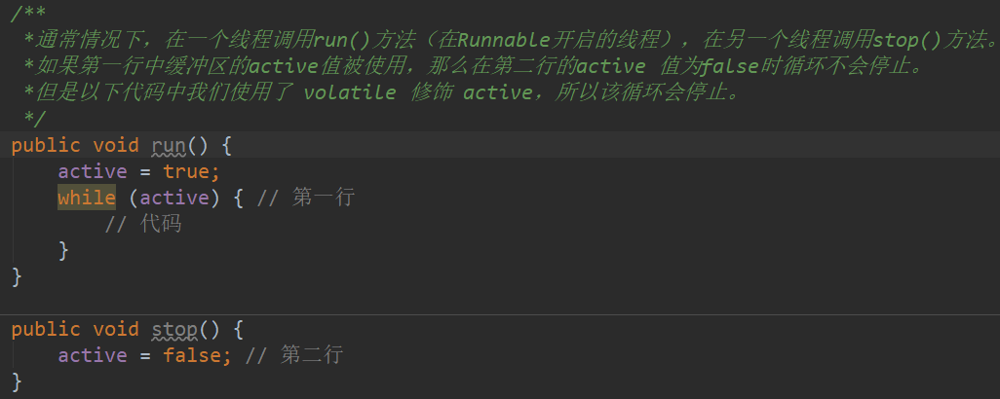

## 关键字
[https://www.cnblogs.com/zyx110/p/10621592.html]()  
关键字对java的编译器有特殊的意义，他们用来表示一种数据类型，或者表示程序的结构等

### 用于定义数据类型的关键字
+ byte
+ short
+ int 
+ long
+ float
+ double
+ char
+ Boolean
+ void
+ class
+ interface
### 用于定义数据类型值
+ true
+ false
+ null
### 用于定义流程控制
+ if
+ else
+ switch
+ case
+ default
switch…case…default  
当switch里的key没有匹配的时候，执行default里的方法  
+ while
+ do
+ for
+ break
+ continue
+ return
### 用于定义访问权限修饰符

+ public  
    公开的
    默认接口的方法是public和abstract的，所以没必要声明。 同时，如果你使用private(导致接口无意义)或者protected(矛盾)都会报错。
+ protected  
    受保护的  
    [https://blog.csdn.net/blacktal/article/details/81198579]()  
    + protected的成员（成员变量或成员方法）只能在**同包**或**子类中**访问到  
    + 父子类 不同包，父类中有protected修饰的变量p，在**子类中**可以通过this或创建自身的对象访问到该变量p，因为这个p被子类所继承
    + 但是子类中不可以通过创建一个父类的对象来访问p,因为此时p不作为子类继承的成员，而是作为父类的成员,
    + 但是父类的成员在其他包中，父类的对象也无法访问到
+ default  
    默认 
+ private  
    私有的  
    
### 用于定义类、函数、变量修饰符
+ static  
    + 静态变量  
        无论一个类实例化多少对象，它的静态变量只有一份拷贝
        局部变量不能被声明为 static 变量
    + 静态方法  
        通过int a = new User().age;  或者 int a = User.age 调用
        在static 方法内部不能调用非静态方法，反过来可以
        (静态方法是属于类【加载在方法区】的，非静态方法是属于对象【实例化在堆中】的，类先于对象存在,所以如果静态方法调用非静态方法的话，可能会报空指针异常。)
    + 静态内部类  
        普通类是不允许声明为静态的，只有内部类才可以，被static修饰的内部类可以直接作为一个普通类来使用，而不需实例一个外部类
        没有用static修饰内部类
        OuterClass oc = new OuterClass();   oc.new InnerClass();
        被static修饰的内部类
        new OuterClass.InnerClass();

    + 说明   
        只是声明变量在主存上的唯一性，不能保证工作区（每个线程）与主存区变量值的一致性
+ abstract  
    抽象的  
    抽象类不能用来实例化对象，声明抽象类的唯一目的是为了将来对该类进行扩充。
    一个类不能同时被 abstract 和 final 修饰。如果一个类包含抽象方法，那么该类一定要声明为抽象类，否则将出现编译错误。
    抽象类可以包含抽象方法和非抽象方法
    抽象方法不能被声明成 final 和 static（因为 static 是类级别【在方法区】的不能被子类覆盖【写@Override会报错，不写@Override不会报错可以理解为重新定义了相同名称的静态方法】）。
+ final  
    最终的  
    final 修饰的类不能够被继承；修饰的方法不能被继承类重新定义；修饰的变量为常量，是不可修改的；
+ synchronized  
    同步的  
    synchronized 关键字声明的方法同一时间只能被一个线程访问。
    + 说明
    不仅包含内存同步（一致性），且保证线程互斥（互斥性）

### 用于定义类与类之间关系
+ extends
+ implements
### 用于定义建立实例及引用实例，判断实例
+ new  
+ this  
 [http://c.biancheng.net/view/953.html]()
    + 1.this.属性名  
    局部变量和成员变量同名，程序又需要在该方法里访问这个被覆盖的成员变量
    + 2.this.方法名  
    让类中一个方法，访问该类里的另一个方法或实例变量  
    this 可以代表任何对象，当 this 出现在某个方法体中时，它所代表的对象是不确定的，但它的类型是确定的，它所代表的只能是当前类的实例。只有当这个方法被调用时，它所代表的对象才被确定下来，谁在调用这个方法，this 就代表谁
    + 3.this( )访问构造方法  
        + this( ) 不能在普通方法中使用，只能写在构造方法中。
        + 在构造方法中使用时，必须是第一条语句。
        
+ super
+ instanceof

### 用于异常处理
+ try
+ catch
+ finally
+ throw
+ throws

### 用于包
+ package
+ import

### 其他修饰符
+ native  
+ strictfp  
    strict float point (精确浮点)  
    你可以将一个类、接口以及方法声明为strictfp，但是不允许对接口中的方法以及构造函数声明strictfp关键字
    如果你想让你的浮点运算更加精确，而且不会因为不同的硬件平台所执行的结果不一致的话，可以用关键字strictfp
+ transient  
    将不需要序列化的属性前添加关键字transient，序列化对象的时候，这个属性就不会被序列化  
    + 1）一旦变量被transient修饰，变量将不再是对象持久化(保存到硬盘)的一部分，该变量内容在序列化后无法获得访问。  
    + 2）transient关键字只能修饰变量，而不能修饰方法和类。注意，本地变量是不能被transient关键字修饰的。变量如果是用户自定义类变量，则该类需要实现Serializable接口。  
    + 3）被transient关键字修饰的变量不再能被序列化，一个静态变量不管是否被transient修饰，均不能被序列化。
      
+ volatile  
    volatile 修饰的成员变量在每次被线程访问时，都强制从共享内存中重新读取该成员变量的值。而且，当成员变量发生变化时，会强制线程将变化值回写到共享内存。这样在任何时刻，两个不同的线程总是看到某个成员变量的同一个值。  
    volatile可以用在任何变量前面，但不能用于final变量前面，因为final型的变量是禁止修改的。  
    一个 volatile 对象引用可能是 null  
    
    + 说明  
    Java内存模型负责各个线程的工作区与主存区的该字段的值保持同步，即一致性  

+ assert  

### 保留字
+ goto
