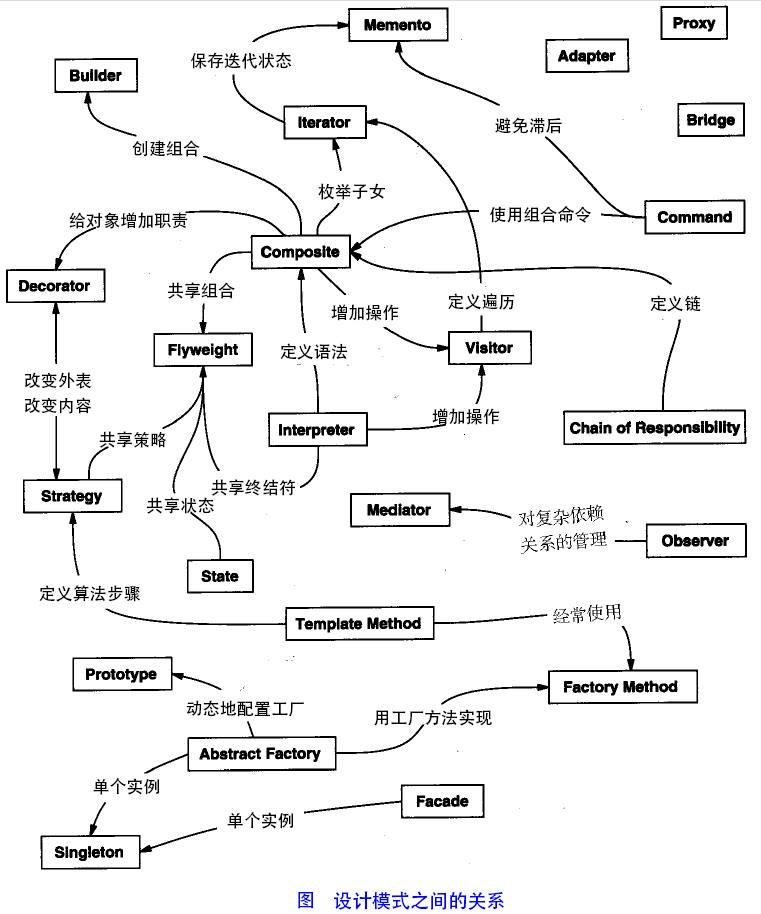
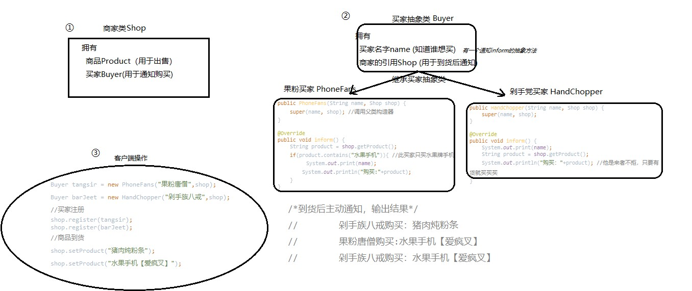
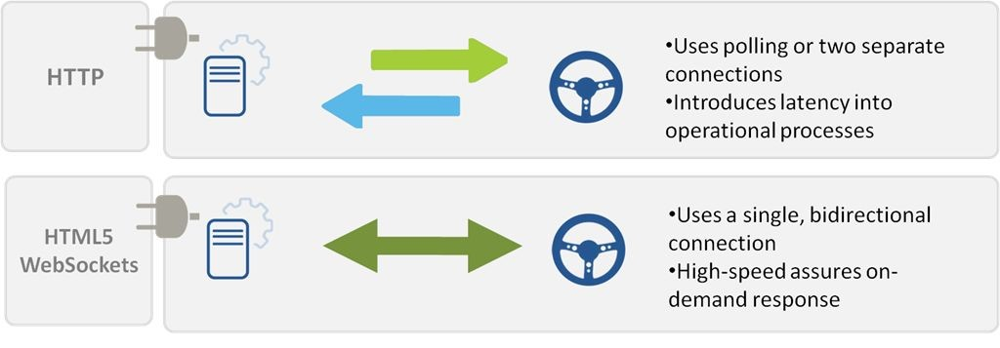

1994年，GOF四人帮出版设计模式 - 可复用的面向对象软件元素，一共提到三大类23种设计模式。使用设计模式是为了重用代码、让代码更容易被他人理解、保证代码可靠性。
## 设计模式的六大原则
### 总原则：开闭原则
对扩展开放，对修改关闭，实现一个热插拔的效果(推荐使用接口和抽象类)

### 单一职责原则
每个类应该实现单一的职责，如若不然，就应该把类拆分
### 里氏替换原则
任何基类可以出现的地方，子类一定可以出现
### 依赖倒转原则
针对接口编程，依赖于抽象而不依赖于具体
### 接口隔离原则
使用多个隔离的接口，比使用单个接口要好。它还有另外一个意思是：降低类之间的耦合度。由此可见，其实设计模式就是从大型软件架构出发、便于升级和维护的软件设计思想，它强调降低依赖，降低耦合
### 迪米特法则，又称最少知道原则
一个实体应当尽量少地与其他实体之间发生相互作用，使得系统功能模块相对独立
### 合成复用原则
尽量使用合成/聚合的方式，而不是使用继承


## 创建型模式
### 单例模式
#### 饿汉模式
```java
class Test{
    //优点：没有加锁，执行效率会提高（如果对象不是很占空间，或不用考虑内存问题可以优先考虑此模式）
    //缺点：类加载时就初始化，浪费内存。
    private static final God god = new God();//自有永有的神单例
    private God(){}//构造方法私有化
    public static God getInstance(){//请神方法公开化
        return god;
    }
}
```
#### 懒汉模式
````java
class Test{
    //懒加载，多线程安全
    //优点：第一次调用才初始化，避免内存浪费
    //缺点：必须加synchronized才能保证单例，但加锁会影响效率
    private static God god; //这里不进行实例化
    private God(){} //保证任何人都不能去创建神的实例，使构造方法私有化
    public static synchronized God getInstance(){//不管什么情况先加锁，难免会影响效率
        if(null == god){
            god = new God();
        }
        return god;
    }
}
````
#### 双重校验锁
```java
class Test{
    //多线程安全，懒加载
    //安全且在多线程情况下能保持高性能
    private volatile static God god;
    private God(){}
    public static God getInstance() {//庙是开放的不用排队进入
        if (god == null) {//如果头柱香未产生，这批抢香人进入堂内排队。
            synchronized(God.class){
                if (god == null) {//只有头香造了神，其他抢香的白排队了
                    god = new God();
                }
            }
        }
        //此处头柱香产生后不必再排队
        return god;
    }
}
```
对于两次instance的是否为空的判断解释：
1. 为何在synchronized外面的判断？  
   为了提高性能！如果拿掉这次的判断那么在执行的时候就会直接的运行synchronized，所以这会使每个getInstance()都会得到一个静态内部锁，这样的话锁的获得以及释放的开销（包括上下文切换，内存同步等）都不可避免，降低了效率。所以在synchronization前面再加一次判断是否为空，则会大大降低synchronization块的执行次数。
2. 为何在synchronized内部还要执行一次呢？  
    因为可能会有多个线程一起进入同步块外的 if，如果在同步块内不进行二次检验的话就会生成多个实例了。
    PS：双重检验情况下，保存实例的唯一的静态变量要用volatile修饰，否则由于线程安全原因，一个类仍然有会生成多个实例。

### 工厂方法模式
### 抽象工厂模式
### 建造者模式
### 原型模式
**用于创建重复的对象，同时又能保证性能**  
$\color{red}{
浅拷贝：仅仅是指向被复制的内存地址，如果原地址值修改（指引用类型）发生改变，那么浅复制出来的对象也会相应的改变(拿人手短)。    
深拷贝：在计算机中开辟一块新的内存地址用于存放复制的对象(自食其力)  
}$

**使用场景：** 
一个对象需要提供给其他对象访问，而且各个调用者可能都需要修改其值时（考虑使用深拷贝还是浅拷贝），可以考虑使用原型模式拷贝多个对象供调用者使用。 在实际项目中，原型模式很少单独出现，一般是和工厂方法模式一起出现，通过 clone的方法创建一个对象，然后由工厂方法提供给调用者。

## 结构型模式
### 适配器模式
### 装饰器模式
### 代理模式
[https://www.jianshu.com/p/8ccdbe00ff06]()
### 静态代理
### 动态代理
### 外观模式
### 桥接模式
### 组合模式
### 享元模式
在有大量对象时，有可能会造成内存溢出，我们把其中共同的部分抽象出来，如果有相同的业务请求，直接返回在内存中已有的对象(唯一标识码)，避免重新创建。
**优点：**
+ 大大减少对象的创建，降低系统的内存，更有可能降低数据库的访问频率，使效率提高。
**缺点：**
+ 提高了系统的复杂度，需要分离出外部状态和内部状态，而且外部状态具有固有化的性质，不应该随着内部状态的变化而变化，否则会造成系统的混乱
**注意：**
+ 频繁更改的对象不太适合使用享元模式
**场景：**	
+ 权限
+ 菜单

## 行为型模式
### 观察者模式
案例：(代码库)  
假设某件商品（水果手机）卖得非常火爆，长期处于脱销的状态。由于供不应求，师徒四人也加入了抢购的队伍，不时的去商店询问是否有货，导致整日在商店门口徘徊。
转变思想  
与其让观察者不断的询问不如当到货的时候让商家主动通知观察者们来买。  
  
**观察者模式解决了基于一对多对象结构关系间的互动问题，使观察者（多方买家）专主动为被动，被观察者（单方商家）转被动为主动，此情此景，需动静结合，先后有序，以【一方动多方静】取代【多方动一方静】的模式，大大的提高了沟通效率，别再偷窥了，我show给你好看。**    
其实，最初商家与买家之间的互动行为非常类似于Web应用中的Poll行为，由于Http无状态连接协议的安全特性，服务端（商家）无法主动推送（Push）消息给客户端（买家），所以有时会用到Poll技术，也就是不断的轮询服务端，有没有更新？有没有更新？有没有更新？严重时，成千上万的客户端会造成服务器瘫痪，所以之后诞生的WebSocket正是为了解决这个问题，这便类似于我们的观察者模式。  
  

### 策略模式
### 模板方法模式
### 迭代子模式
### 责任链模式
### 命令模式
### 备忘录模式
### 状态模式
### 访问者模式
### 中介者模式
### 解释器模式

