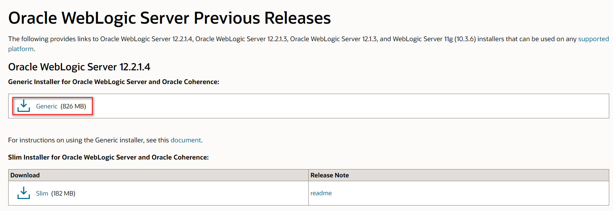
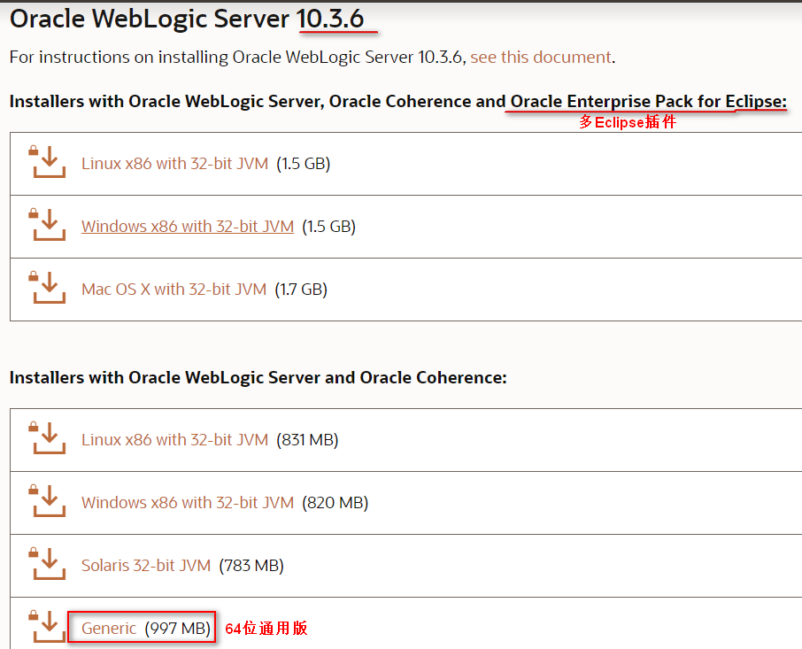

# weblogic官方下载地址
[点我跳转下载页面](https://www.oracle.com/middleware/technologies/weblogic-server-installers-downloads.html "weblogic官方下载地址")    
***WebLogic如果下载64位，JDK也需要64位***

# 12c通用版
  
+ weblogic12.2.1.3必须JDK8，而且EL表达式会报很多的错误(如果写的不规范)
+ weblogic12.1.3.0.0可以JDK7，当然可以8，而且不会报错，建议安装的时候选择这个版本
+ 由于使用wls1213_dev.zip进行安装的weblogic仅用于开发环境，而且不能进行补丁升级。生产环境上要下载安装的是Generic包

# 11g通用版
   
+ WebLogic 11g默认JDK版本为1.6，要使用1.7时需解决兼容性问题，解决办法见 问题