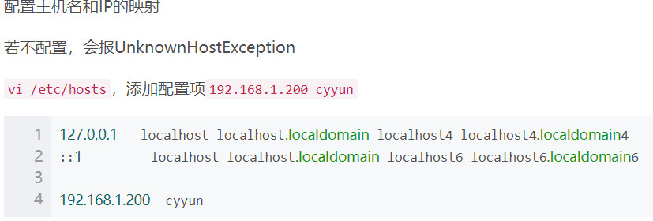
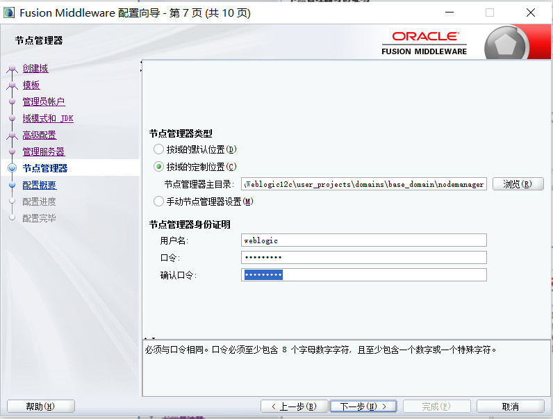
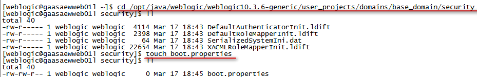

# 区别
## Oracle JDeveloper 12c (12.2.1.4.0)
Oracle JDeveloper 是一个免费的集成开发环境 (IDE)，简化了 Java 应用开发，解决了应用生命周期的每个步骤。   

## Oracle WebLogic Server
服务器版本  

---

# Linux
## 命令行方式
参考资料：  
> https://www.cnblogs.com/yinfengjiujian/p/9492403.html
### 规划
操作系统	 | 主机IP      | 端口    | 角色	            | 备注
-------- | ------------|--------| ------------------|------------
Redhat6	 | 11.18.7.39  | 7001   | AdminServer	    | 管理服务器
Redhat6	 | 11.18.7.39  | 28080  | Proxy_Server	    | 代理服务器
Redhat6	 | 11.18.7.39  | 18080  | Managed_Server_39	| 受管服务器
Redhat6	 | 11.18.7.40  | 18080  | Managed_Server_40	| 受管服务器

### 准备工作
1. 新建用户组 weblogic
    ```text
    groupadd weblogic
    ```
2. 新建用户weblogic 并修改用户密码
    ```text
    useradd -d /opt/java/weblogic -g weblogic weblogic
    ```
3. 更换目录所有者和组
    ```text
    [root@gaasaewweb01l java]# chown -R weblogic /opt/java/weblogic
    [root@gaasaewweb01l java]# chmod -R 777 /opt/java/weblogic
    ```
4. 确认JDK版本等环境  
    12c需jdk1.8  
    ```text
    java -version
    ```
5. 配置主机名和IP的映射(未配置)
  

6. 上传安装包fmw_12.2.1.4.0_wls.jar 
    1. 使用weblogic用户登录winScp或同类工具
    2. 上传安装包fmw_12.2.1.4.0_wls.jar至/opt/java/weblogic路径下

### 安装
1. 使用weblogic用户登录secureCRT或同类工具
2. 切换至安装包路径下
    ```text
    [weblogic@gaasaewweb01l ~]$ cd /opt/java/weblogic/
    ```
3. 创建、编辑oraInst.loc文件
对于UNIX用户来说，如果这是你第一次安装Oracle的产品，你必须先创建oraInst.loc文件。  
    ```text
    [weblogic@gaasaewweb01l ~]$ touch oraInst.loc
    [weblogic@gaasaewweb01l ~]$ vi oraInst.loc
    ```    
    添加内容如下：  
    ```text
    #产品清单目录（如果原来安装过Oracle的产品那么这步可以省略，不需要指定oraInventory 目录）
    inventory_loc=/usr/local/products/oraInventory
    #用户的组名称，根据实际的修改
    inst_group=weblogic
    ```
4. 创建、编辑响应文件wls.rsp
    ```text
        [weblogic@gaasaewweb01l ~]$ touch wls.rsp
        [weblogic@gaasaewweb01l ~]$ vi wls.rsp
    ```  
    此处***只修改ORACLE_HOME***的路径，即WebLogic Server的安装路径   
    ```text
    [ENGINE]
    
    #DO NOT CHANGE THIS.
    Response File Version=1.0.0.0.0
    
    [GENERIC]
    
    #The oracle home location. This can be an existing Oracle Home or a new Oracle Home
    ORACLE_HOME=/opt/java/weblogic/weblogic12c
    
    #Set this variable value to the Installation Type selected. e.g. WebLogic Server, Coherence, Complete with Examples.
    INSTALL_TYPE=WebLogic Server
    
    #Provide the My Oracle Support Username. If you wish to ignore Oracle Configuration Manager configuration provide empty string for user name.
    MYORACLESUPPORT_USERNAME=
    
    #Provide the My Oracle Support Password
    MYORACLESUPPORT_PASSWORD=<SECURE VALUE>
    
    #Set this to true if you wish to decline the security updates. Setting this to true and providing empty string for My Oracle Support username will ignore the Oracle Configuration Manager configuration
    DECLINE_SECURITY_UPDATES=true
    
    #Set this to true if My Oracle Support Password is specified
    SECURITY_UPDATES_VIA_MYORACLESUPPORT=false
    
    #Provide the Proxy Host
    PROXY_HOST=
    
    #Provide the Proxy Port
    PROXY_PORT=
    
    #Provide the Proxy Username
    PROXY_USER=
    
    #Provide the Proxy Password
    PROXY_PWD=<SECURE VALUE>
    
    #Type String (URL format) Indicates the OCM Repeater URL which should be of the format [scheme[Http/Https]]://[repeater host]:[repeater port]
    COLLECTOR_SUPPORTHUB_URL=
    ```

5. 执行安装  
    wls.rsp和oraInst.loc文件需使用绝对路径  
    ```text
    [weblogic@gaasaewweb01l ~]$ java -jar ./fmw_12.2.1.4.0_wls.jar -silent -responseFile /opt/java/weblogic/wls.rsp -invPtrLoc /opt/java/weblogic/oraInst.loc
    ```
      
    
    1. 将安装后的weblogic12c文件夹权限修改为777 
    ```text
    [weblogic@gaasaewweb01l ~]$ chmod -R 777 weblogic12c
    ```


### 创建weblogic运行域
1. 创建存放路径
    ```text
    mkdir -p /opt/java/weblogic/weblogic12c/user_projects/domains/base_domain/
    ```
2. 创建参数文件  create_domain.rsp
    如下： 在目录：/opt/java/weblogic/create_domain.rsp
    ```text
    read template from "/opt/java/weblogic/weblogic12c/wlserver/common/templates/wls/wls.jar";
     
    set JavaHome "/opt/java/jdk/jdk1.";
    set ServerStartMode "prod";
     
    find Server "AdminServer" as AdminServer;
    set AdminServer.ListenAddress "";
    set AdminServer.ListenPort "7001";
    set AdminServer.SSL.Enabled "true";
    set AdminServer.SSL.ListenPort "7002";
     
    //Create Machine
    //create Machine "base" as Machinename;
     
    //use templates default weblogic user
    find User "weblogic" as u1;
    set u1.password "1qaz@WSX";
     
    write domain to "/opt/java/weblogic/weblogic12c/user_projects/domains/base_domain/";
     
    // The domain name will be "demo-domain"
     
    close template;　　
    ```
3. 静默创建域
```text
cd /opt/java/weblogic/weblogic12c/wlserver/common/bin
./config.sh -mode=silent -silent_script=/opt/java/weblogic/create_domain.rsp -logfile=/opt/java/weblogic/create_domain.log
```
### 启动服务
```text
%WebLogic_home%\user_projects\domains\base_domain\bin\startWebLogic.cmd 
```

### 进入控制台
http://11.18.7.39:7001/console
    
    
    
    
    
    
    
    
    
    
    
    
    
   
    
 > oracle_weblogic/004.问题.md:must be configured to display at least 256 colors. display environment variable not set 
    
## 配置环境变量
vi .bash_profile
```text
export MW_HOME=/opt/java/weblogic/weblogic12c
```


---

# Windows
1. 以管理员身份运行命令提示符cmd
2. 输入命令： java -jar %jar_home%\fmw_12.2.1.4.0_wls.jar  ORACLE_HOME=weblogic安装路径，注意：该文件夹必须为空文件夹
   ```text
    java -jar  C:\Users\woody\Desktop\fmw_12.2.1.4.0_wls.jar  ORACLE_HOME=C:\Software\Weblogic12c
   ```
   > oracle_weblogic/004.问题.md:报错不是有效的 JDK Java 主目录
3. 自动打开安装界面
    + 下一步
    + 跳过自动更新
    + 安装位置 -> 更换weblogic安装目录
    + 安装类型 -> 含示例的完整安装
    + 先决条件检查 -> 下一步
    + 安装概要 -> 安装
    + 安装进度 -> 下一步
    + 安装完成 -> 去掉[自动启动快速入门配置向导]勾选 -> 完成
4. 配置
    + 以管理员身份运行%weblogic12c_home%\oracle_common\common\bin\config.cmd
        ```text
          C:\Software\Weblogic12c\oracle_common\common\bin\config.cmd
        ```
    + 创建域 -> 创建新域 -> 确认域位置 -> 下一步
    + 模板 -> 下一步
    + 管理员账户 -> 设置名称与口令
           
    +  高级配置 -> 勾选[管理服务器][节点服务器] -> 下一步
    + 管理服务器 -> 下一步
    + 节点管理器 
           
        节点管理身份证明，我输入的和管理员账户相同  
        -> 下一步  
    + 配置概要 -> 创建  
    + 配置进度 -> 下一步
    + 配置完毕 -> 勾选[启动节点服务器] -> 完成
    + 弹出启动窗口，显示 Server state changed to RUNNING 表示启动成功
5. 打开管理控制台
    
    [http://localhost:7001/console](http://localhost:7001/console "管理控制台")
       
    > oracle_weblogic/004.问题.md:解决Weblogic启动慢或者控制台访问慢的问题  
    
    登录慢也可能是启动命令窗口卡住，按回车即可 
       

6. 配置  
    + 配置环境变量  
        %weblogic_home%\user_projects\domains\base_domain\bin\setDomainEnv.sh  
        注意jdk版本和位数	  
        **修改-Xms(初始化堆内存)、-Xmx(最大堆内存)，参数值大小根据机器性能配置**  
            
        
        ```text
            set WLS_HOME=%WL_HOME%\server
            
            set WLS_MEM_ARGS_64BIT=-Xms768m -Xmx1024m
            
            set WLS_MEM_ARGS_32BIT=-Xms512m -Xmx512m
            
            if NOT "%JAVA_VENDOR%"=="HP" (
                if "%VM_TYPE%"=="HotSpot" (
                    set WLS_MEM_ARGS_64BIT=-Xms512m -Xmx1024m
                    set WLS_MEM_ARGS_32BIT=-Xms256m -Xmx512m
                )
            )
            
            set MEM_ARGS_64BIT=%WLS_MEM_ARGS_64BIT%
            
            set MEM_ARGS_32BIT=%WLS_MEM_ARGS_32BIT%
        ```
    + 启动报日志文件转换异常
        > oracle_weblogic/004.问题.md:Error rotating log file
    + 解决Weblogic启动慢或者控制台访问慢的问题  
        > oracle_weblogic/004.问题.md:解决Weblogic启动慢或者控制台访问慢的问题  
        
    + 创建免密文件  
          
            