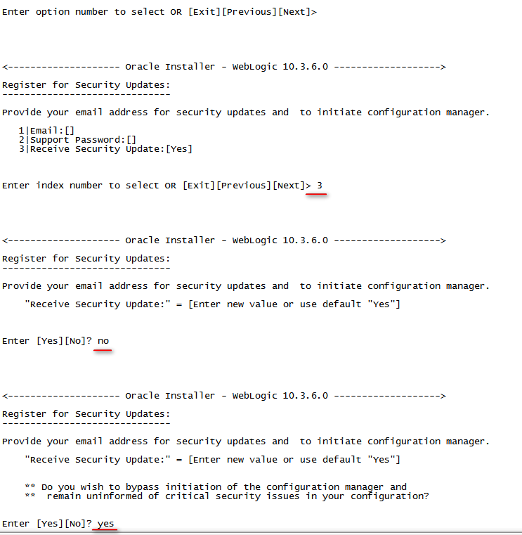
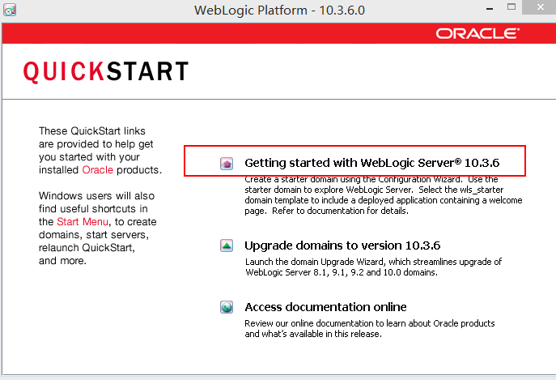

#Linux
+ 服务器规划
    + 查看服务器版本、位数、JDK版本等信息
    + 规划
    
    操作系统	 | 主机IP      | 端口    | 角色	            | 备注
    -------- | ------------|--------| ------------------|------------
    Redhat6	 | 11.18.7.39  | 7001   | AdminServer	    | 管理服务器
    Redhat6	 | 11.18.7.39  | 28080  | Proxy_Server	    | 代理服务器
    Redhat6	 | 11.18.7.39  | 18080  | Managed_Server_39	| 受管服务器
    Redhat6	 | 11.18.7.40  | 18080  | Managed_Server_40	| 受管服务器
+ 安装组件
    + 创建weblogic组 groupadd weblogic
    + 创建weblogic用户并分配组和指定路径 useradd -d /opt/java/weblogic -g weblogic weblogic
    + 切换至weblogic用户下，更换目录所有者和组
    + 上传weblogic安装包
    + 执行安装
        + .bin文件直接执行：./xxx.bin
        + .jar使用java -jar ./xxx.jar执行  
              
    + 安装路径  
          
    + 安全更新  
          
    + 安装类型  
          
    + 选择JDK（本人选择本地安装的JDK1.7）  
          
    + 安装完成  
          
    + 验证是否已安装成功：cat %weblogic_home%/logs/log.txt  
+ 创建domain  
      
    + 选择模板  
          
    + 域名  
          
    + 配置管理员账号、密码  
          
    + 选择开发或生产模式  
          
    + 配置可选配置  
          
    + 创建完成  
          
    + 观察安装目录下多一个user_projects目录  
+ 配置  
    + 创建免密文件  
          
          
    + 解决Weblogic启动慢或者控制台访问慢的问题  
          
    + 配置环境变量  
        %weblogic_home%\user_projects\domains\base_domain\bin\setDomainEnv.sh  
        注意jdk版本和位数	  
        **修改-Xms(初始化堆内存)、-Xmx(最大堆内存)、--XX:PermSize（永久代，1.8使用元空间替代）、--XX:MaxPermSize这4个参数，参数值大小根据机器性能配置**  
          
    
+ 控制台配置  
    + 启动　　
          
            
    + 配置machine　　
          
          
          
    + 新建cluste  　　
          
          
    +　新建Server　　
          
          
          
          
          
          
          
+　配置Nodemanager　　
      
+　配置免密文件（与上一个文件不同）　
      　
+ 配置受管服务器　　
    + 将管理服务器安装路径下文件全部打包，在受管服务器解压　
      
    + 删除多余文件　
      
    防止误操作
+ 启动　　
      
+ 测试单节点部署　　
      
      
      
      
+ 配置代理服务器
***可在控制台创建代理服务器，其性质与受管服务器一样，但需手动复制用于请求分发的项目proxyApp，11的步骤便可省略***
项目结构如下：  
  

+ 文件内容如下：  
    + web.xml  
```xml
<!DOCTYPE web-app PUBLIC "-//Sun Microsystems, Inc.//DTD Web Application 2.3//EN" "http://java.sun.com/dtd/web-app_2_3.dtd">
<web-app>
    <servlet>
        <servlet-name>HttpClusterServlet</servlet-name>
        <servlet-class>weblogic.servlet.proxy.HttpClusterServlet</servlet-class>
        <init-param>
        <param-name>WebLogicCluster</param-name>
        <param-value>11.18.7.40:18080|11.18.7.39:18080</param-value>
        </init-param>
    </servlet>
    <servlet-mapping>
        <servlet-name>HttpClusterServlet</servlet-name>
        <url-pattern>/</url-pattern>
    </servlet-mapping>
    <servlet-mapping>
    <servlet-name>HttpClusterServlet</servlet-name>
    <url-pattern>*.jsp</url-pattern>
    </servlet-mapping>
    <servlet-mapping>
    <servlet-name>HttpClusterServlet</servlet-name>
    <url-pattern>*.jspx</url-pattern>
    </servlet-mapping>
    <servlet-mapping>
    <servlet-name>HttpClusterServlet</servlet-name>
    <url-pattern>*.htm</url-pattern>
    </servlet-mapping>
    <servlet-mapping>
    <servlet-name>HttpClusterServlet</servlet-name>
    <url-pattern>*.html</url-pattern>
    </servlet-mapping>
    <servlet-mapping>
    <servlet-name>HttpClusterServlet</servlet-name>
    <url-pattern>*.jpd</url-pattern>
    </servlet-mapping>
    <servlet-mapping>
    <servlet-name>HttpClusterServlet</servlet-name>
    <url-pattern>*.jcx</url-pattern>
    </servlet-mapping>
    <servlet-mapping>
    <servlet-name>HttpClusterServlet</servlet-name>
    <url-pattern>*.dtf</url-pattern>
    </servlet-mapping>
    <servlet-mapping>
    <servlet-name>HttpClusterServlet</servlet-name>
    <url-pattern>*.jws</url-pattern>
    </servlet-mapping>
</web-app>

```
  + weblogic.xml
```xml
<?xml version="1.0" encoding="UTF-8"?>
    <weblogic-web-app xmlns="http://xmlns.oracle.com/weblogic/weblogic-web-app"
    xmlns:xsi="http://www.w3.org/2001/XMLSchema-instance"
    xsi:schemaLocation="http://xmlns.oracle.com/weblogic/weblogic-web-app http://xmlns.oracle.com/weblogic/weblogic-web-app/1.3/weblogic-web-app.xsd">

    <!--上下文根-->
    <context-root>/Track</context-root>

    <container-descriptor>
        <!--开发环境-->
        <!--servlet检查以查看 servlet是否已更改-->
        <servlet-reload-check-secs>1</servlet-reload-check-secs>
        <!--检查资源是否发生修改-->
        <resource-reload-check-secs>1</resource-reload-check-secs>

        <!--生产环境-->
        <!--<servlet-reload-check-secs>-1</servlet-reload-check-secs>-->
        <!--<resource-reload-check-secs>-1</resource-reload-check-secs>-->


        <!-- 让weblogic在冲突情况下,默认采用web应用下的lib,而不采用它本身classpath下的jar包-->
        <prefer-web-inf-classes>false</prefer-web-inf-classes>

        <!--对于我们项目用到的一些和weblogic有冲突的jar包让他以我们项目为主-->
        <!--<prefer-application-packages>-->
            <!--<package-name>javax.servlet.http.*</package-name>-->
            <!--<package-name>javax.xml.*</package-name>-->
        <!--</prefer-application-packages>-->

        <show-archived-real-path-enabled>true</show-archived-real-path-enabled>
    </container-descriptor>


    <!--编码-->
    <charset-params>
        <input-charset>
            <resource-path>/*</resource-path>
            <java-charset-name>UTF-8</java-charset-name>
        </input-charset>
    </charset-params>

    <!-- session共享 -->
    <session-descriptor>
        <!--
            memory:禁用永久会话存储
            replicated：与内存相同，但会话数据是跨群集服务器复制的
            replicated_if_clustered：如果Web应用程序部署在群集服务器上，则将复制有效的持久存储类型。否则，默认为内存
            async-replicated：在应用程序或Web应用程序中启用异步会话复制
            async-replicated-if-clustered：在部署到群集环境时启用应用程序或Web应用程序中的异步会话复制。如果部署到单个服务器环境，则会话持久性/复制默认为内存中。这允许在单个服务器上进行测试，而不会出现部署错误
            file：使用基于文件的持久性
            async-jdbc：为应用程序或Web应用程序中的HTTP会话启用异步JDBC持久性
            jdbc：使用数据库存储持久会话
            cookie：所有会话数据都存储在用户浏览器的cookie中
        -->
        <persistent-store-type>async-replicated-if-clustered</persistent-store-type>
        <sharing-enabled>true</sharing-enabled>
    </session-descriptor>

    <jsp-descriptor>
        <!--开发环境-->
        <!-- 在 JSP 编译过程中保存作为中间步骤生成的 Java 文件。除非此参数设置为 true，否则编译完成后将删除所有中间 Java 文件。 -->
        <keepgenerated>true</keepgenerated>
        <!-- -1表示永不检查页面。该值为生产环境中的默认值。0表示总是检查页面。1表示每秒检查一次页面。该值为开发环境中的默认值-->
        <page-check-seconds>1</page-check-seconds>

        <!--生产环境-->
        <!--<page-check-seconds>-1</page-check-seconds>-->


        <!--&lt;!&ndash;如果设置为 true，当部署或重新部署 Web应用程序时，或启动 WebLogic时，WebLogic Server会自动预编译所有已修改的JSP&ndash;&gt;-->
        <!--<precompile>true</precompile>-->
        <!--&lt;!&ndash; 如果设置为 true，即使编译期间其中某些 JSP 失败，WebLogic Server也会继续预编译所有已修改的 JSP。仅当 precompile设置为true时才生效。 &ndash;&gt;-->
        <!--<precompile-continue>true</precompile-continue>-->

    </jsp-descriptor>
</weblogic-web-app>

```
   + 执行  
       
   + 扩展模板  
       
       
       
   + 创建代理服务器  
       
   + 创建http应用程序  
       
       
       
       
       
       
   + 启动，测试集群和单节点  
       


# Windows
1. 进入安装文件wls1036_generic.jar所在文件夹 然后输入命令： Java -jar wls1036_generic.jar
2. 创建新的中间件目录：选择自己要安装的路径
3. 是否接收安全更新：不用输内容，直接下一步，点击两次Yes，如果提示连接失败，在 我希望不接收配置中存在的安全问题前打勾，点击继续。
4. 自定义安装
5. 选择本地JDK
6. 运行QuickStart
7. 使用Weblogic服务启动    
    
8. 创建新的WebLogic域  
9. 全部选中  
     
10. 域使用默认的目录  
     
11. 输入账号密码  
     
 
12. 开发模式，JDK为自已的  
13. 全选，下一步  
     
14. 下一步  
  

15. 下一步  
     
16. 后面全部下一步即可，采用默认的配置  
17. 启动

# 卸载
开始菜单找到以下图标点击卸载  
     
