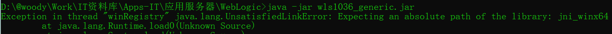
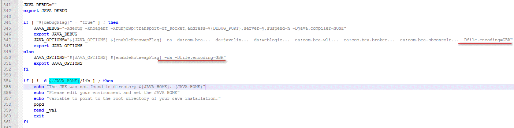
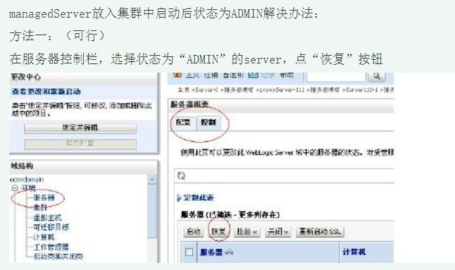

# WebLogic 10.3.6与JDK 1.7的兼容问题
https://blog.csdn.net/weixin_33806300/article/details/92309132  
http://docs.oracle.com/cd/E23943_01/doc.1111/e14142/jdk7.htm  
解决方案：将weblogic安装目录下%WL_HOME%/modules下的三个jar包  
javax.annotation_1.0.0.0_1-0.jar  
javax.xml.bind_2.1.1.jar  
javax.xml.ws_2.1.1.jar  
拷贝到%JAVA_HOME%/jre/lib/endorsed（如果没有请创建）下即可解决weblogic与jdk1.7之间的兼容问题。  

# The error is weblogic.descriptor.DescriptorException
weblogic10.3.6不支持web-app_3_0.xsd的定义，替换方式如下：
```xml
<web-app version="2.5"
         xmlns="http://java.sun.com/xml/ns/javaee"
         xmlns:xsi="http://www.w3.org/2001/XMLSchema-instance"
         xsi:schemaLocation="http://java.sun.com/xml/ns/javaee http://java.sun.com/xml/ns/javaee/web-app_2_5.xsd">
```
servlet中display-name、description可删除

# 安装报错Expecting an absolute path of the library  
  
原因：路径包含中文  

# 解决Weblogic启动慢或者控制台访问慢的问题
修改%JDK_HOME%\jre1.7.0_80\lib\security\java.security文件
将securerandom.source=file:/dev/urandom调整为securerandom.source=file:/dev/./urandom

# proxyserver访问乱码，单独节点正常
1. 把proxyServer 应用的weblogic.xml 加上如下内容（本项目编码为GBK）
```xml
<charset-params>
    <input-charset>
        <resource-path>/*</resource-path>
        <java-charset-name>GBK</java-charset-name>
    </input-charset>
</charset-params>
```
2. 如果无法解决
修改%weblogic_home%\user_projects\domains\base_domain\bin\setDomainEnv.sh
set JAVA_OPTIONS=-Dfile.encoding=GBK  
  

# 服务器状态显示Admin
  

# .setup.SipAnnotationParsingException

# <BEA-000110> <Multicast socket receive error
需要在%weblogic_root%\user_projects\domains\base_domain\bin\setDomainEnv文件***的JAVA_OPTIONS中增加-Djava.net.preferIPv4Stack=true参数***    
if [ "${debugFlag}" = "true" ] ; then  
JAVA_DEBUG="-Xdebug -Xnoagent -Xrunjdwp:transport=dt_socket,address=${DEBUG_PORT},server=y,suspend=n -Djava.compiler=NONE"   
export JAVA_DEBUG   
JAVA_OPTIONS="${JAVA_OPTIONS} ${enableHotswapFlag} -ea -da:com.bea... -da:javelin... -da:weblogic... -ea:com.bea.wli... -ea:com.bea.broker... -ea:com.bea.sbconsole... ***-Djava.net.preferIPv4Stack=true"***  
export JAVA_OPTIONS  
else  
JAVA_OPTIONS="${JAVA_OPTIONS} ${enableHotswapFlag} -da ***-Djava.net.preferIPv4Stack=true"***  
export JAVA_OPTIONS  
