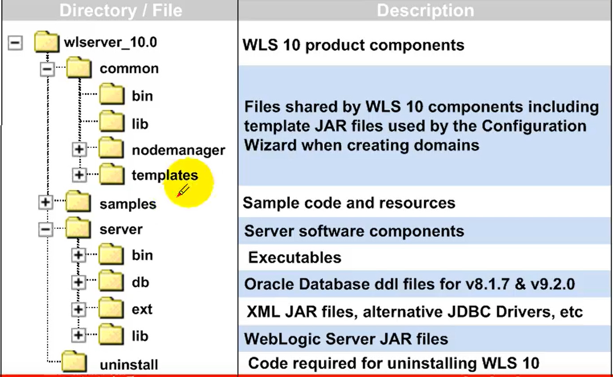
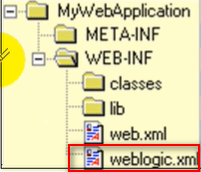
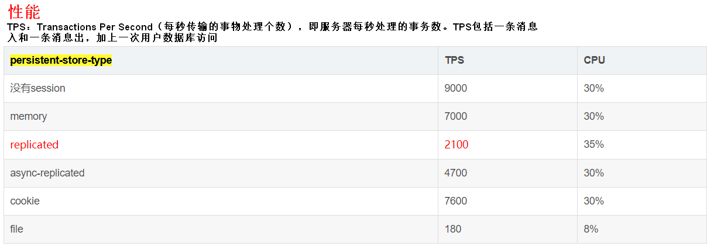
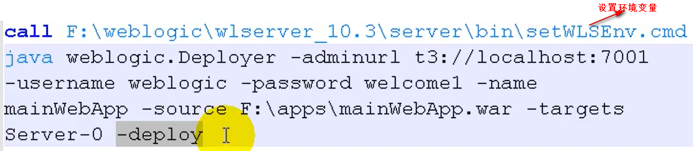
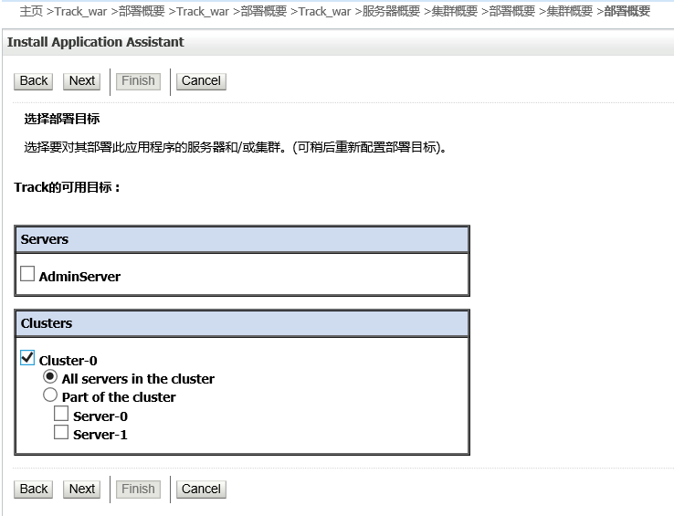
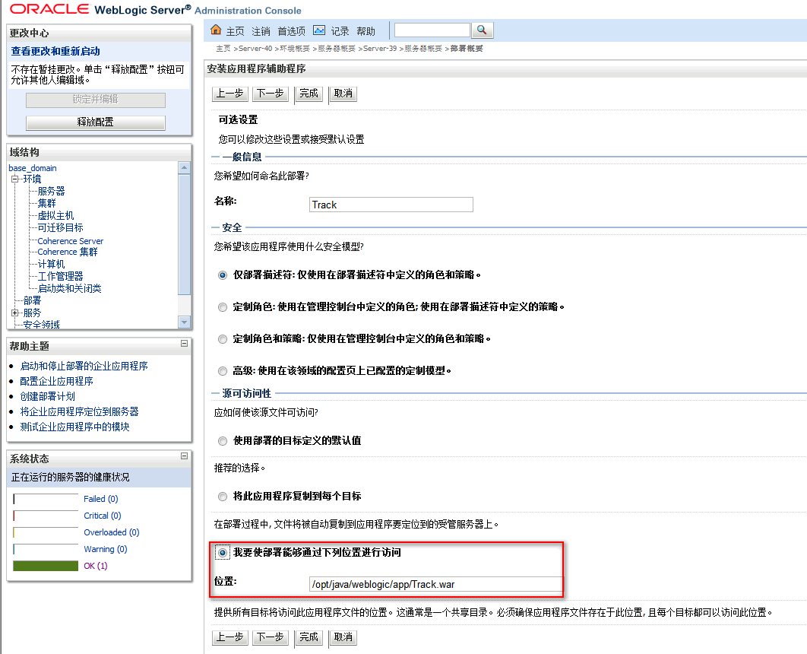

# 目录结构
  

# 打包成WebLogic的web应用程序目录结构  
  
**WebLogic项目需在WEB-INF下添加weblogic.xml配置文件，它可以配置**  
  
参数说明  
+ session-descriptor
    + persistent-store-type
        + memory:禁用永久会话存储
        + replicated：与内存相同，但会话数据是跨群集服务器复制的
        + replicated_if_clustered：如果Web应用程序部署在群集服务器上，则将复制有效的持久存储类型。否则，默认为内存
        + async-replicated：在应用程序或Web应用程序中启用异步会话复制
        + async-replicated-if-clustered：在部署到群集环境时启用应用程序或Web应用程序中的异步会话复制。如果部署到单个服务器环境，则会话持久性/复制默认为内存中。这允许在单个服务器上进行测试，而不会出现部署错误
        + file：使用基于文件的持久性
        + async-jdbc：为应用程序或Web应用程序中的HTTP会话启用异步JDBC持久性
        + jdbc：使用数据库存储持久会话
        + cookie：所有会话数据都存储在用户浏览器的cookie中
   

# 测试项目
将%weblogic_home%/wlserver_10.3/samples/server/examples/build/mainWebApp  
放在%weblogic_root%/user_projects/domains/base_domain/autodeploy下  

# 日志
## Server log
位置：serverName/logs/serverName.log  
如：  
%weblogic_root%\wlserver_10.3\common\bin\servers\ serverName(如AdminServer/Server-0)\logs\serverName.log(如AdminServer.log/ Server-0.log)  
## Domain log
%domain_root%/adminServer(管理机serverName)/logs/base_domain.log(domainName.log)  

# 管理控制台
http://localhost:7001/console  

#部署项目
## 单节点
### console-控制台部署
1. 准备好war包
2. 上传至服务器
3. 控制台 -> 锁定并编辑 -> base_domain -> 部署
4. 安装 -> 选择路径 -> 勾选 -> 下一步 -> 将此部署安装为应用程序
5. 将此应用程序复制到每个目标（管理服务器和受管服务器不在同一个服务器会做拷贝）
6. 完成
7. 激活更改
## autodeploy-自动部署
自动部署适合开发阶段使用，在生产环境中，不建议使用
直接把web应用文件夹copy到domains/example/autodeploy就可以了
## weblogic deploy-命令部署
  

## 集群
### console
1. 上传war包（如果服务器 -> 配置 -> 部署 -> 临时模式选择不存放，则每个服务器都要上传war包）
2. 控制台 -> Deployments -> install -> 选择war包路径 -> 将此部署安装为应用程序
3. 选择部署目标 
  
  
4. 完成 -> 激活并更改

# 启动
## 单节点
管理服务器：%WebLogic_home %\user_projects\domains\base_domain\bin\startWebLogic.cmd  
节点服务器：%weblogic_home%\wlserver_10.3\server\bin\startNodeManager.cmd localhost 5556（节点ip port）  
被管服务器：%weblogic_home%\wlserver_10.3\common\bin\startManagedWebLogic.cmd Server-40 http://localhost:7001 (管理机ip:port） 或 在控制台启动  

## 集群
管理器：%WebLogic_home %\user_projects\domains\base_domain\bin\startWeblogic.sh  
各节点管理器：%weblogic_home%\wlserver_10.3\server\bin\startNodeManager.sh localhost 5556（节点ip port）  
各被管服务器：%weblogic_home%\wlserver_10.3\common\bin\ startManagedWeblogic.sh 管理机ip:port） 或 在控制台启动  

部署项目（2个）  
# 关闭  
%WebLogic_home %\user_projects\domains\base_domain\bin\stopManagedWebLogic.sh  
%WebLogic_home %\user_projects\domains\base_domain\bin\stopWebLogic.sh  
如果无法关闭，使用lsof -i:port 或 ps -ef | grep weblogic查看进程的PID，使用kill PID杀掉进程  
