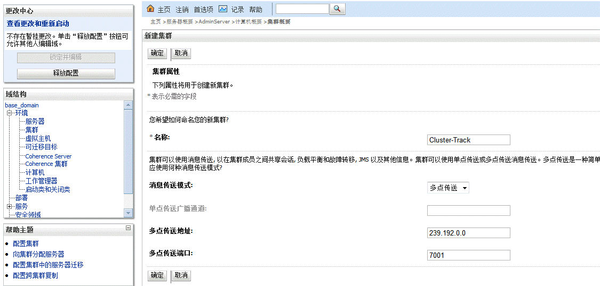
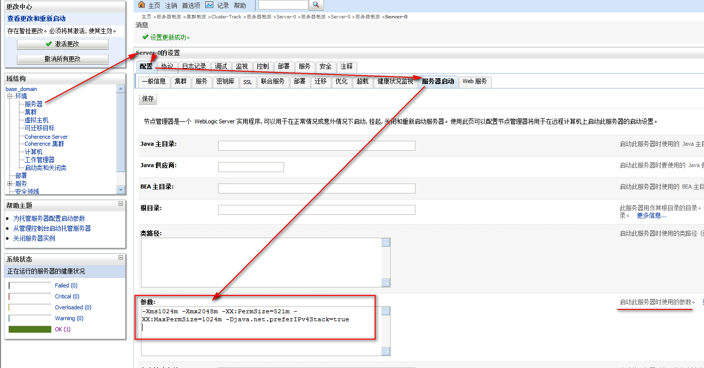

# domains账号密码
本机：base_domain：weblogic/woody1435  

# 创建免密文件
在%webLogic_root%\user_projects\domains\base_domain\ security（没有则创建）  与
%webLogic_root%\user_projects\domains\base_domain\servers\AdminServer\security ***文件夹下各创建boot.properties文件***（生产模式不会自动创建，开发模式会创建）：  
username=username  
password=password  
***然后使用命令行启动AdminServer，才会自动生成安全文件  
再启动Managed Server，此次需要用户名和密码，然后下载安全信息***（%webLogic_root%/wlserver_10.3/common/bin/security||config||servers||tmp文件）  
  

# Machine配置
1. 控制台 -> Machines -> new
2. 填写计算机标识：机器名（Server-39）、操作系统(unix)
3. 填写节点管理器属性：SSL、IP(11.18.7.39)、port（5556）
4. 完成 -> 激活更改

# 集群（cluster）
  
+ 负载均衡
+ 高可用

## 创建  
1. 控制台 -> 环境 -> 集群 -> 创建  
2. 集群属性
  
**【消息传送模式】**
指定在集群中使用的消息传送类型。提供多点传送消息传送是为了向后兼容。建议新集群使用单点传送 (默认值)  
**单播**  
指定用于处理集群中通信的通道。如果未指定任何通道，则使用默认通道。如果使用单点传送消息传送类型，则仅支持 ClusterBroadcastChannel。  
**多播**  
集群成员用来相互通信的多点传送地址  
多播的地址范围在：224.0.0.0 – 239.255.255.255之间，端口1-65535  
  
集群地址就是受管理服务器的IP地址：端口号（不包括代理服务器），以逗号隔开  
    
   
3. 将现有服务器添加到此集群  
点击集群名 -> 第二层选项卡servers -> add -> 选择服务器添加   
Cluster-Track、单点  

# 节点管理器(nodemanager)配置
环境 -> 服务器 -> AdminServer -> 配置 -> SSL -> 高级  
设置管理服务器主机名验证为“无”  

# 配置受管服务器(managed)
console  
1. 锁定并编辑
2. 环境 -> 服务器
    
3.	新建一个服务器
相当于给受管服务器起名（如Server-0），端口7003（因在同一台服务器，需换端口，且7002是保护端口），受管服务器可以在任意一台可访问的主机上（需要配置监听地址）
      
4.	被管理服务器与主机对应关系设置
    
5.	部署临时配置为“不存放” ？？？
    
 
6.	设置一般日志文件大小及限制保留的文件数等：
  
 
7.	设置不启动HTTP访问日志文件：
 
 
8.	设置数据源日志文件大小及限制保留文件数：  
  
 
9.	被管理服务器启动内存参数配置：
-Xms2048m -Xmx3072m -XX:PermSize=512m -XX:MaxPermSize=1024m -Djava.net.preferIPv4Stack=true  
  
点击“激活更改”，使配置生效  

# Session复制
例Track-Cluster创建两个复制组TrackRepGroup1, TrackRepGroup2。  
TrackRepGroup1包含受管服务器A,B  
TrackRepGroup2包含受管服务器C  
  
在weblogic.xml中配置  
  
