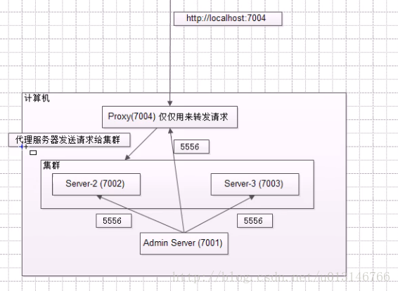
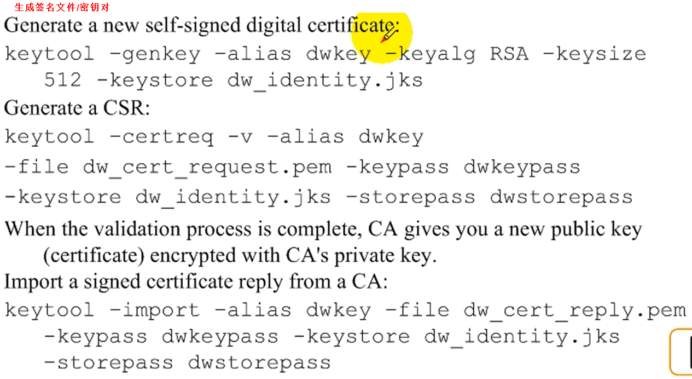

# 架构  
   
  

# proxy server  
代理服务器  
  
1. 定向请求
2. 负载均衡

# fire walls
防火墙  
  
1. 过滤
2. 认证
3. 授权

# web server  
1. 接收请求

# Application Server
1. 执行应用
2. 分布式

# Domain
一组逻辑相关的WebLogic服务
  

# domain template  
域模板  
可用于快速创建域（如base_domain_1）和备份域  
运行：%webLogic_root%/wlserver_10.3/common/bin/config_builder  
# extension template  
扩展模板  
用于更改一个已存在的weblogic domain（如base_domain），扩展一些服务  
运行：%webLogic_root%/wlserver_10.3/common/bin/config_builder  

# administrator server  
管理服务器  
它的角色相当于老板  
  

# Node Manager  
是一个守护进程，需要使用WLST命令管理  
它的角色相当于一个经理或监工  
+ 作用  
    + 启动、关闭、重启管理服务器和受管服务器  
    + 监视所有Server并收集日志数据   
+ 版本  
    + Java-Based  
    + Script-Based  

# managed server
受管服务器  
它的角色相当于工人  

# MSI
配置当管理服务器不可用时是否可以启动受管服务器  
至少有一次管理服务器启动后启动了受管服务器，那么当管理服务器down机后，受管服务器是能单独启动的（因为本地已经下载了# domain的配置信息）  
配置方式：控制台 -> 环境 -> 服务器 -> server-0 -> 优化 -> 高级 -> 启用受管服务器独立性  
  

# 管理服务器的备份
A（管理机）B、C（受管服务器）  
+ 确定B、C已经安装了weblogic server 
+ 创建与A服务器相同domain名称的目录如base_domain在备份机的weblogic user_projects目录下
+ 从当前机器weblogic其它domain拷贝bin可执行目录到当前domain，并修改配置文件（startWeblogic、setDoaminEnv）
+ 从A	服务器拷贝配置信息到备份机（比如B）  
domain/base_domain/config  
domain/base_domain/init-info  
domain/base_domain/security  
+ 拷贝应用文件到备份机（比如B）  
+ 启动B管理机
+ 重启C受管机（因为当A down机后，将B重新配置为管理机，但C监听的还是A服务器，所以需要将C重启 或者 设置DNS）

# DNS  
DNS可映射多个IP地址，所以当管理机down机后，受管服务器也会尝试连接DNS映射的其它IP，便达到了不用重启管理机C的目的  

# SSL  
利用公钥和私钥，对数据加密，加密后使用https访问，安全端口变为7002(https://localhost:7002)  
环境 -> 服务器 -> 详情  
  
**生成签名文件**  

# WLST
the weblogic scripting tool 脚本工具
控制台需要一项项配置，而使用脚本工具可以自动化批量更改和部署应用

# snmp
简单网络管理协议，如管理：  
+ 桥
+ 路由
+ 服务器
+ 打印机
# EJB类型

# JNDI

# Session Management
会话管理  
如：server-1配置  

server-2复制组配置相反  
